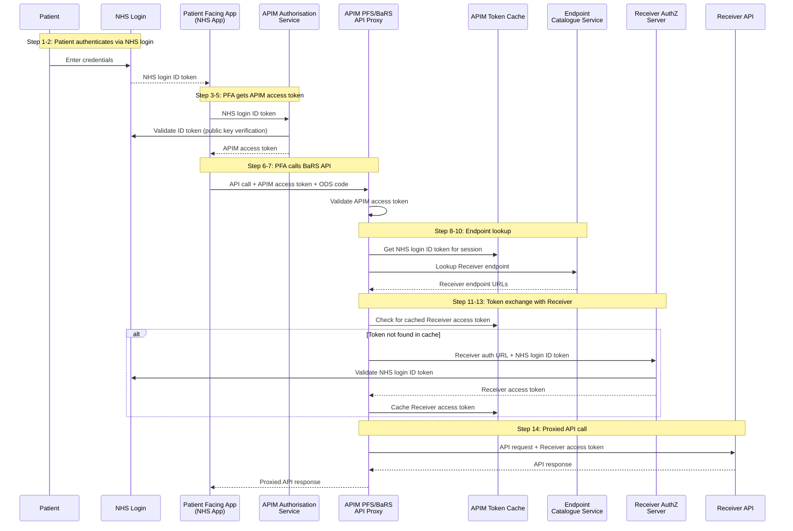
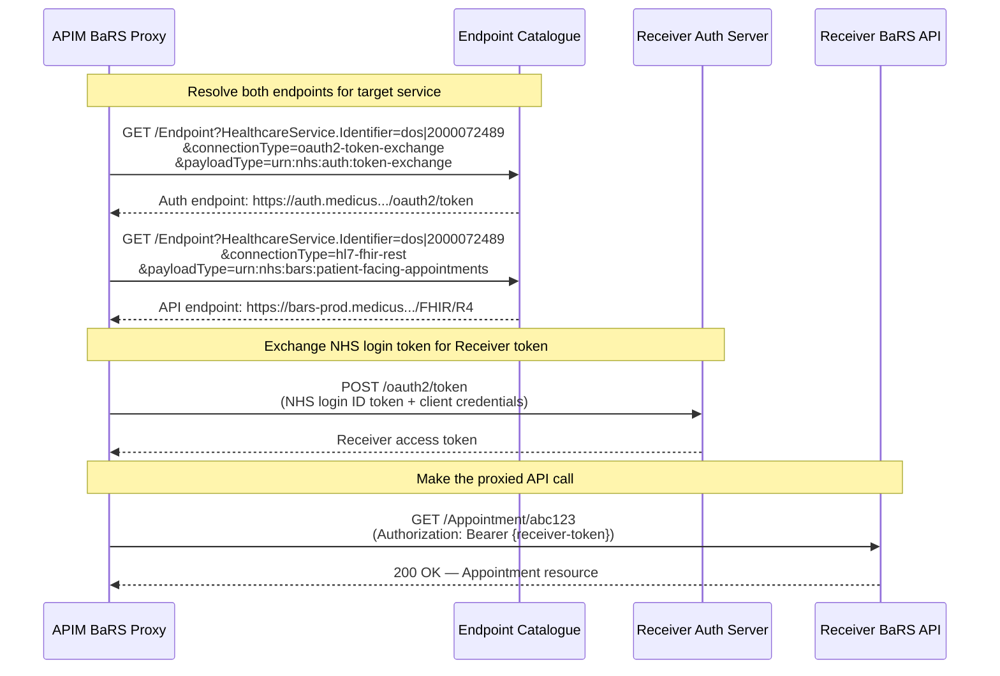
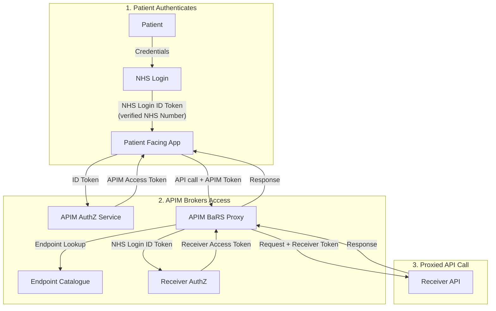

# Patient-Facing BaRS (NHS Login — Separate Authentication and Authorisation)

## Overview

This page details what needs to change for BaRS Appointment interactions to be **patient-facing** — i.e., initiated directly by a citizen authenticated via [NHS login](https://digital.nhs.uk/services/nhs-login). This shifts the trust model from organisation-to-organisation (B2B) to citizen-to-service (B2C), with significant implications for authentication, authorisation, data access, and API design.

The authentication and authorisation pattern follows the **NHS login separate authentication and authorisation** model, as established in the [Clinical Data Sharing APIs (PFS D6)](https://nhsd-confluence.digital.nhs.uk/display/DCA/PFS+D6+-+Auth+Token+Exchange) decision and documented in the [NHS developer guidance](https://digital.nhs.uk/developer/guides-and-documentation/security-and-authorisation/user-restricted-restful-apis-nhs-login-separate-authentication-and-authorisation).

## The Pattern: Separate Authentication and Authorisation

With this pattern, authentication (proving who the user is) and authorisation (getting permission to call an API) are performed **separately**:

- **Authentication** happens when the patient signs in via NHS login. The Patient Facing Application (PFA) receives an NHS login ID token.
- **Authorisation** happens later, when the PFA needs to call the BaRS API. The APIM platform exchanges the NHS login ID token for an access token that the Receiver's system will accept.

This separation means:
- The patient authenticates once at login time
- The PFA only requests API authorisation if and when it actually needs to call the API
- The APIM platform acts as a **single trusted origin** for all Receiver systems, eliminating the need for each PFA to be individually onboarded with each Receiver

## Architecture — Token Exchange within APIM

Following the PFS D6 decision, **APIM handles the token exchange** between the PFA and the Receiver. This is the same pattern used by GP Connect Patient Facing Services.

### Why APIM handles the exchange

- Presents a **single trusted origin** to Receivers — Receivers only need to trust APIM, not every patient-facing application individually
- Prevents abuse and misuse — PFAs cannot be set up as trusted origins on Receiver authorisation servers directly
- Provides **central oversight, standards, and metrics** to NHS England
- **Low burden for Receivers** — only one origin to trust, no third-party accreditation
- **Low burden for PFAs** — no need to know which backend system is being called (APIM handles endpoint lookup and token exchange)
- NHS England provides the first line of defence against abuse, reducing burden on Receivers

### Overview Diagram



### Step by Step

Prior to step 1, the patient accesses the NHS App (or other PFA) and initiates login.

| Step | Action                     | Description                                                                                                                                   |
| ------| ----------------------------| -----------------------------------------------------------------------------------------------------------------------------------------------|
| 1    | Patient enters credentials | Patient authenticates with NHS login (P9 — high identity verification)                                                                        |
| 2    | NHS login → PFA            | NHS login returns control to the PFA with an **NHS login ID token**                                                                           |
| 3    | PFA → APIM AuthZ           | PFA presents the NHS login ID token to the APIM authorisation service                                                                         |
| 4    | APIM validates             | APIM authorisation service validates the NHS login ID token using NHS login's public key                                                      |
| 5    | APIM → PFA                 | APIM returns an **APIM access token** to the PFA                                                                                              |
| 6    | PFA → BaRS API Proxy       | PFA makes a request to the BaRS API proxy within APIM, including the APIM access token (in header) and the subject's NHS Number (in URL/body) |
| 7    | Proxy validates            | BaRS API proxy validates the APIM access token                                                                                                |
| 8    | Proxy → Token Cache        | Proxy retrieves the cached NHS login ID token for this session                                                                                |
| 9    | Proxy → Endpoint Service   | Proxy looks up the Receiver's endpoint (via Endpoint Catalogue)                                                                               |
| 10   | Endpoint Service → Proxy   | Returns Receiver endpoint URLs (including auth URL)                                                                                           |
| 11   | Proxy → Receiver AuthZ     | Proxy presents the NHS login ID token to the Receiver's authorisation server (via the Receiver's auth URL)                                    |
| 12   | Receiver AuthZ validates   | Receiver's authorisation server validates the NHS login ID token with NHS login                                                               |
| 13   | Receiver AuthZ → Proxy     | Receiver authorisation server returns a **Receiver access token**                                                                             |
| 14   | Proxy → Receiver API       | Proxy makes the actual API request to the Receiver with the Receiver access token                                                             |

### Token Types in Play

| Token | Issued by | Used by | Purpose |
|-------|-----------|---------|---------|
| **NHS login ID token** | NHS login | APIM (to verify patient identity and to present to Receiver AuthZ) | Proves the patient's identity; contains verified NHS Number |
| **APIM access token** | APIM Authorisation Service | PFA (to call the BaRS API Proxy) | Authenticates the PFA's request to APIM |
| **Receiver access token** | Receiver's AuthZ server | APIM Proxy (to call the Receiver's API) | Grants access to the specific Receiver's APIs on behalf of the patient |

### Caching

The APIM proxy caches:
- The **NHS login ID token** — so it can be reused for subsequent token exchanges during the session without re-prompting the patient
- The **Receiver access token** — so repeated calls to the same Receiver don't require a fresh token exchange each time

This is handled within APIM's internal token cache. The PFA never sees or handles the Receiver access token directly.

---

## Key Differences from B2B BaRS

| Aspect | B2B (Current) | Patient-Facing (B2C) |
|---|---|---|
| **Authentication** | Application-restricted (signed JWT, client credentials) | User-restricted (NHS login ID token → APIM access token → Receiver token exchange) |
| **Who initiates** | A healthcare system on behalf of a clinician/operator | The patient themselves via an app |
| **Patient context** | Passed in request body (NHS Number in FHIR resource) | Derived from the NHS login ID token — the patient can only act on their own record |
| **Authorisation model** | Organisation-level (ODS code trusted) | User-level (patient can only book/view/cancel their own appointments) |
| **Consent** | Implied (organisation has legitimate relationship) | Explicit (OAuth scopes granted by the patient) |
| **Target header** | `NHSD-End-User-Organisation` carries the sending org | Not applicable — patient identity is in the token chain |
| **Token exchange** | None (single application token throughout) | APIM exchanges NHS login token for Receiver-specific access token on each call |
| **Receiver trusts** | The sending organisation (via ODS code in token) | APIM as single trusted origin (Receiver only needs to trust APIM, not every PFA) |

---

## What Needs to Change

### 1. Authentication — NHS Login Separate Auth Pattern

**Current state:** BaRS uses application-restricted access. The calling system authenticates itself using a signed JWT (client credentials flow). There is no individual user identity.

**Required change:** Patient-facing access uses the **separate authentication and authorisation** pattern:

1. The patient authenticates via NHS login (P9 — high identity verification).
2. The PFA receives an **NHS login ID token** (OIDC ID token containing verified NHS Number and identity claims).
3. The PFA presents this to the **APIM authorisation service**, which validates it and returns an **APIM access token**.
4. When the PFA calls the BaRS API, the **APIM proxy handles all downstream token exchange** — the PFA never directly communicates with the Receiver's auth server.
5. APIM exchanges the NHS login ID token for a **Receiver access token** by calling the Receiver's authorisation server.
6. APIM makes the API call to the Receiver with the Receiver access token.

**Key architectural point:** The PFA only ever talks to APIM. APIM acts as a broker, performing endpoint lookup, token exchange, and request proxying. This is the same pattern established by PFS D6 for GP Connect Patient Facing Services.

### 2. Scoping and Consent

The OAuth scopes for patient-facing BaRS need to be defined. Suggested scope model:

| Scope | Permits |
|---|---|
| `urn:nhsd:apim:user-nhs-login:aal3:booking-and-referral/patient-access` | Base access to patient-facing BaRS |
| `patient/Slot.read` | Search for available slots |
| `patient/Appointment.read` | View own appointments |
| `patient/Appointment.write` | Book, update, or cancel own appointments |

The patient must explicitly consent to these scopes during the NHS login flow. The scopes constrain what operations the APIM access token permits.

### 3. Patient Context Enforcement

**Current state:** The patient's NHS Number is included in the request body. The system is trusted to supply the correct identity.

**Required change:** In patient-facing mode, the patient identity is **derived from the NHS login ID token**, not trusted from the request body:

- The NHS login ID token contains the patient's verified NHS Number.
- This NHS Number flows through the token exchange — the Receiver access token is scoped to this patient.
- The **Receiver** must validate the access token, extract the patient identity, and verify that any patient identifier in the request matches. Mismatches must be rejected (HTTP 401).
- This prevents a patient from acting on another person's record.

**Validation rule:**
```
token.patient_nhs_number == request.body.participant[*].actor.identifier.value (NHS Number)
```

### 4. Endpoint Lookup (Service Discovery)

As per [PFS D1 — Endpoint lookup and resolution](https://nhsd-confluence.digital.nhs.uk/spaces/DCA/pages/520341345/PFS+D1+-+Endpoint+lookup+and+resolution), APIM handles endpoint lookup:

- The PFA provides the patient's ODS code (registered GP practice)
- APIM queries the Endpoint Catalogue service to find the Receiver's API URLs and auth server URL
- The PFA doesn't need to know which backend system is being called — APIM resolves this transparently

For BaRS patient-facing appointments, the lookup uses the target service identifier (e.g. the service the patient wants to book with), resolved via the Endpoint Catalogue.

### 5. Handling `NHSD-End-User-Organisation` in Patient-Facing Flows

**Current state:** In B2B BaRS, the `NHSD-End-User-Organisation` header is **mandatory** on every request. It carries a Base64-encoded FHIR Organization resource identifying the sending organisation (ODS code). Receivers use it for:
- Authorisation (ownership checks — does this org have permission to access this endpoint?)
- Address masking (public/private visibility)
- Audit (which organisation sent the request)

**The problem in PFS:** A patient isn't acting on behalf of an organisation. They're acting as themselves. The header's current semantics ("the organisation making this request") don't map cleanly to a citizen-initiated interaction.

#### Options

| Option | Approach | Pros | Cons |
|--------|----------|------|------|
| **A — Patient's registered GP ODS code** | APIM looks up the patient's registered GP from PDS and injects that ODS code as the `NHSD-End-User-Organisation` | Backwards compatible — Receivers that validate the header won't break. Data is available from PDS/NHS login claims. | Semantically misleading — the GP practice isn't "sending" the request. Could trigger unintended authorisation rules (e.g. Receiver only accepts from certain orgs). |
| **B — Synthetic "patient access" identifier** | Define a well-known code (e.g. ODS code `PATIENT-DIRECT` or a distinct Organization resource with `system: https://fhir.nhs.uk/Id/patient-access-origin`) | Clear semantics — Receivers can explicitly distinguish patient-initiated from org-initiated requests. Enables different business rules. | Breaking change — Receivers must be updated to accept this new value. Not backwards compatible with current validation. |
| **C — Make header optional for PFS** | Relax the mandatory constraint for user-restricted tokens. Omit the header entirely for patient-facing flows. | Clean — removes ambiguity by simply not sending a header that doesn't apply. | Spec change required. Receivers that unconditionally require the header will reject requests. |
| **D — APIM platform ODS code** | APIM injects its own ODS code (representing NHS England API Platform as the trusted origin) | Backwards compatible — header is present and valid. Semantically correct: APIM *is* the sending system from the Receiver's perspective. Consistent with APIM being the single trusted origin. | Receivers cannot distinguish which patient-facing app originated the request from the header alone (but this is available from the token). |

#### Recommendation

**Option D (APIM platform ODS code)** is recommended as the primary approach, with Option B as a future enhancement:

1. **Short term (Option D):** APIM populates `NHSD-End-User-Organisation` with a Base64-encoded Organization identifying the NHS England API Platform (e.g. ODS code `X26` or a dedicated PFS platform code). This:
   - Maintains backwards compatibility — the header is present and valid
   - Is semantically accurate — APIM is the trusted origin that the Receiver has onboarded
   - Allows Receivers to apply a blanket "trust APIM" rule rather than per-organisation rules
   - The *patient's* identity comes from the access token, not from this header

2. **Longer term (Option B enhancement):** Once Receivers have adapted to patient-facing flows, introduce a dedicated `patient-access` identifier type in the header that explicitly signals "this is a patient-initiated request." This enables Receivers to apply patient-specific business rules (e.g. different slot availability, different cancellation policies).

#### What the header would look like (Option D)

```json
{
  "resourceType": "Organization",
  "identifier": [
    {
      "system": "https://fhir.nhs.uk/Id/ods-organization-code",
      "value": "X26"
    }
  ],
  "name": "NHS England API Platform (Patient Facing Services)"
}
```

Base64-encoded: `eyJyZXNvdXJjZVR5cGUiOiJPcmdhbml6YXRpb24iLCJpZGVudGlmaWVyIjpbeyJzeXN0ZW0iOiJodHRwczovL2ZoaXIubmhzLnVrL0lkL29kcy1vcmdhbml6YXRpb24tY29kZSIsInZhbHVlIjoiWDI2In1dLCJuYW1lIjoiTkhTIEVuZ2xhbmQgQVBJIFBsYXRmb3JtIChQYXRpZW50IEZhY2luZyBTZXJ2aWNlcykifQ==`

#### Impact on Receivers

| Receiver behaviour | Option D impact |
|--------------------|-----------------|
| Validates header is present | ✅ No change — header is present |
| Validates ODS code format | ✅ No change — valid ODS code |
| Uses ODS code for ownership/access control | ⚠️ Receiver must recognise the APIM ODS code as a permitted "sender" for patient-facing flows. This is part of onboarding. |
| Uses ODS code for audit | ✅ Audit records show APIM as the origin. Patient identity is audited separately from the token. |
| Applies org-specific business rules | ⚠️ Receiver should not apply org-specific rules to the platform code — patient-facing access should have its own rule set |

#### Decision needed

This is a design decision that should be confirmed with the NHS API Platform team and the BaRS Core specification owners. The key question:

> Should the `NHSD-End-User-Organisation` header for patient-facing flows carry the APIM platform identity (Option D), or should the specification be updated to accommodate patient-direct semantics (Option B/C)?

Until this is resolved, Option D provides a backwards-compatible path that doesn't require spec changes.

### 6. New / Modified Headers

| Header | Change |
|---|---|
| `Authorization` | Carries the **APIM access token** (user-restricted, not application-restricted) |
| `NHSD-End-User-Organisation` | Carries the **APIM platform identity** (Option D — see Section 5 above). Not the patient's org. Patient identity is in the token. |
| `NHSD-Target-Identifier` | Unchanged — still identifies the target service |
| `X-Request-Id` / `X-Correlation-Id` | Unchanged |

Note: The Receiver access token is handled **internally by APIM** — it appears in the proxied request from APIM to the Receiver but is never seen by the PFA.

### 6. Permitted Operations (Patient Scope)

Not all BaRS operations are appropriate for patients. The patient-facing subset:

| Operation | Patient Can Do? | Notes |
|---|---|---|
| `GET /Slot` | ✅ Yes | Search available slots at a selected service |
| `POST /Appointment` | ✅ Yes | Book an appointment for themselves |
| `GET /Appointment/{id}` | ✅ Yes | View their own appointment only |
| `PATCH /Appointment/{id}` | ⚠️ Limited | Cancel own appointment (status → `cancelled`). Reschedule may be permitted. |
| `PUT /Appointment/{id}` | ❌ No | Full resource replacement not appropriate for patients |

### 7. Service Discovery for Patients

For patient-facing booking, the service discovery model is simplified:

- **Option A – Pre-curated services:** The PFA presents a curated list of bookable services (e.g., "GP surgery", "local pharmacy", "UTC near me") without exposing the full DoS query interface.
- **Option B – Constrained search:** The patient provides location/service type and the PFA queries the Endpoint Catalogue on their behalf.
- **Option C – Deep link:** The patient is directed to a specific service (e.g., via NHS.uk or NHS App) and the service identifier is pre-populated.

In all cases, the target service must indicate it **accepts patient-initiated bookings** via its directory entry or CapabilityStatement.

### 8. CapabilityStatement Extension

The Receiver's `/metadata` response should indicate support for patient-facing interactions:

```json
{
  "resourceType": "CapabilityStatement",
  "rest": [{
    "security": {
      "service": [{
        "coding": [{
          "system": "http://terminology.hl7.org/CodeSystem/restful-security-service",
          "code": "SMART-on-FHIR"
        }]
      }],
      "extension": [{
        "url": "https://fhir.nhs.uk/StructureDefinition/BaRS-PatientFacing-Access",
        "valueBoolean": true
      }]
    },
    "resource": [{
      "type": "Appointment",
      "interaction": [
        {"code": "create"},
        {"code": "read"},
        {"code": "patch"}
      ],
      "extension": [{
        "url": "https://fhir.nhs.uk/StructureDefinition/BaRS-PatientFacing-Supported",
        "valueBoolean": true
      }]
    }]
  }]
}
```

### 9. Audit and Logging

Patient-facing interactions must record:

- The authenticated patient's NHS Number (from the NHS login ID token)
- The identity verification level (P9)
- The patient-facing application identifier (client_id of the PFA)
- Consent scopes granted
- The APIM request ID and correlation ID

This is critical for UK GDPR compliance and investigating complaints.

### 10. Rate Limiting and Abuse Prevention

Patient-facing APIs are exposed to a larger, less trusted user base. Additional protections:

- **Per-user rate limits:** Limit bookings/searches per NHS Number per time window
- **Per-app rate limits:** Limit total PFA throughput
- **Slot hoarding prevention:** Consider a "hold" pattern with short TTL rather than immediate hard booking
- **CAPTCHA / bot prevention:** If exposed via web, anti-automation measures

APIM provides the first line of defence — it validates tokens and applies rate limits before any request reaches the Receiver.

---

## Receiver Responsibilities

Systems that wish to accept patient-initiated bookings must:

1. **Set up an authorisation server** that accepts NHS login ID tokens (presented by APIM as a trusted origin) and issues Receiver access tokens scoped to the patient.
2. **Register APIM as a trusted origin** — APIM is the single origin that calls the Receiver's AuthZ server. Individual PFAs are never registered directly.
3. Declare patient-facing support in their `CapabilityStatement`.
4. Validate the Receiver access token on each API request (signature, expiry, scopes).
5. Extract the patient NHS Number from the token and enforce own-record-only access.
6. Apply appropriate business rules (cancellation windows, slot limits, etc.).
7. Return patient-appropriate error messages (no internal system details in OperationOutcome).

### Why this is low burden for Receivers

- Only **one trusted origin** to configure (APIM) — not every PFA individually
- No third-party accreditation process needed for each new PFA
- NHS England provides the first line of defence against abuse and misuse
- Follows the same pattern already established by GP Connect Patient Facing Services

---

## Comparison with Option 2 (No APIM Token Exchange — Rejected)

For context, the alternative of having each PFA directly exchange tokens with each Receiver was considered and rejected (PFS D6):

| Aspect | Option 1: APIM exchange (chosen) | Option 2: Direct PFA-to-Receiver (rejected) |
|---|---|---|
| PFA burden | Low — PFA only talks to APIM | High — PFA must onboard with every Receiver |
| Receiver burden | Low — only one trusted origin (APIM) | High — must validate every PFA |
| Oversight | NHS England has central visibility | Limited oversight |
| Security | NHS England provides first line of defence | Each party manages their own security |
| Development time | Standard | Increased |
| Standards consistency | Guaranteed (APIM enforces) | Risk of non-standard mechanisms |

---

## Endpoint Catalogue — Receiver Auth and API Endpoints

For patient-facing flows, the APIM proxy needs to discover **two** URLs for each Receiver:

1. **The Receiver's authorisation server URL** — where APIM exchanges the NHS login ID token for a Receiver access token
2. **The Receiver's BaRS API URL** — where APIM sends the proxied FHIR request

These are modelled as separate `Endpoint` resources in the Endpoint Catalogue, distinguished by `connectionType` and `payloadType`.

### Endpoint Resource Definitions

#### Receiver Auth Endpoint

| Field | Value |
|-------|-------|
| `connectionType.system` | `https://fhir.nhs.uk/CodeSystem/endpoint-connection-type` |
| `connectionType.code` | `oauth2-token-exchange` |
| `connectionType.display` | `OAuth 2.0 Token Exchange` |
| `payloadType[0].coding[0].system` | `https://fhir.nhs.uk/CodeSystem/endpoint-payload-type` |
| `payloadType[0].coding[0].code` | `urn:nhs:auth:token-exchange` |
| `payloadType[0].coding[0].display` | `Token Exchange` |
| `address` | The Receiver's authorisation server token endpoint URL |

#### Receiver BaRS API Endpoint

| Field | Value |
|-------|-------|
| `connectionType.system` | `http://terminology.hl7.org/CodeSystem/endpoint-connection-type` |
| `connectionType.code` | `hl7-fhir-rest` |
| `connectionType.display` | `HL7 FHIR REST` |
| `payloadType[0].coding[0].system` | `https://fhir.nhs.uk/CodeSystem/endpoint-payload-type` |
| `payloadType[0].coding[0].code` | `urn:nhs:bars:patient-facing-appointments` |
| `payloadType[0].coding[0].display` | `BaRS Patient Facing Appointments` |
| `address` | The Receiver's FHIR R4 API base URL |

### Example: Querying the Endpoint Catalogue

#### Step 1 — Resolve the Auth Endpoint

The APIM proxy queries the Endpoint Catalogue to find the Receiver's token exchange URL, filtering by `connectionType` and `payloadType`:

**Request:**

```http
GET /booking-and-referral/FHIR/R4/Endpoint?HealthcareService.Identifier=https://fhir.nhs.uk/Id/dos-service-id|2000072489&connectionType=https://fhir.nhs.uk/CodeSystem/endpoint-connection-type|oauth2-token-exchange&payloadType=https://fhir.nhs.uk/CodeSystem/endpoint-payload-type|urn:nhs:auth:token-exchange HTTP/1.1
Host: api.service.nhs.uk
Accept: application/fhir+json
X-Request-Id: 74c2b045-9b7d-4b78-aeee-642f6332e3c9
X-Correlation-Id: 0598efa7-fff0-4ade-9af8-3f46b4124151
NHSD-End-User-Organisation: eyJyZXNvdXJjZVR5cGUiOi...
```

**Response:**

```json
{
  "resourceType": "Bundle",
  "type": "searchset",
  "total": 1,
  "entry": [
    {
      "fullUrl": "urn:uuid:auth-ep-medicus-prod",
      "resource": {
        "resourceType": "Endpoint",
        "id": "auth-ep-medicus-prod",
        "status": "active",
        "connectionType": {
          "system": "https://fhir.nhs.uk/CodeSystem/endpoint-connection-type",
          "code": "oauth2-token-exchange",
          "display": "OAuth 2.0 Token Exchange"
        },
        "payloadType": [
          {
            "coding": [
              {
                "system": "https://fhir.nhs.uk/CodeSystem/endpoint-payload-type",
                "code": "urn:nhs:auth:token-exchange",
                "display": "Token Exchange"
              }
            ]
          }
        ],
        "address": "https://auth.medicus.thirdparty.nhs.uk/oauth2/token",
        "managingOrganization": {
          "identifier": {
            "system": "https://fhir.nhs.uk/Id/ods-organization-code",
            "value": "Y12345"
          }
        },
        "name": "Medicus Production Auth Server"
      }
    }
  ]
}
```

#### Step 2 — Resolve the BaRS API Endpoint

The APIM proxy queries the Endpoint Catalogue to find the Receiver's FHIR API URL:

**Request:**

```http
GET /booking-and-referral/FHIR/R4/Endpoint?HealthcareService.Identifier=https://fhir.nhs.uk/Id/dos-service-id|2000072489&connectionType=http://terminology.hl7.org/CodeSystem/endpoint-connection-type|hl7-fhir-rest&payloadType=https://fhir.nhs.uk/CodeSystem/endpoint-payload-type|urn:nhs:bars:patient-facing-appointments HTTP/1.1
Host: api.service.nhs.uk
Accept: application/fhir+json
X-Request-Id: 85d3c156-0e8f-5c89-bfff-753f7443f4da
X-Correlation-Id: 0598efa7-fff0-4ade-9af8-3f46b4124151
NHSD-End-User-Organisation: eyJyZXNvdXJjZVR5cGUiOi...
```

**Response:**

```json
{
  "resourceType": "Bundle",
  "type": "searchset",
  "total": 1,
  "entry": [
    {
      "fullUrl": "urn:uuid:api-ep-medicus-prod",
      "resource": {
        "resourceType": "Endpoint",
        "id": "api-ep-medicus-prod",
        "status": "active",
        "connectionType": {
          "system": "http://terminology.hl7.org/CodeSystem/endpoint-connection-type",
          "code": "hl7-fhir-rest",
          "display": "HL7 FHIR REST"
        },
        "payloadType": [
          {
            "coding": [
              {
                "system": "https://fhir.nhs.uk/CodeSystem/endpoint-payload-type",
                "code": "urn:nhs:bars:patient-facing-appointments",
                "display": "BaRS Patient Facing Appointments"
              }
            ]
          }
        ],
        "address": "https://bars-prod.medicus.thirdparty.nhs.uk/FHIR/R4",
        "managingOrganization": {
          "identifier": {
            "system": "https://fhir.nhs.uk/Id/ods-organization-code",
            "value": "Y12345"
          }
        },
        "name": "Medicus Production BaRS API"
      }
    }
  ]
}
```

### How the Proxy Uses Both Endpoints



### Alternative: Single Query with Multiple Results

If the Endpoint Catalogue supports returning multiple endpoints for the same HealthcareService without filtering, the proxy could make a single query and filter by `connectionType` client-side:

**Request:**

```http
GET /booking-and-referral/FHIR/R4/Endpoint?HealthcareService.Identifier=https://fhir.nhs.uk/Id/dos-service-id|2000072489 HTTP/1.1
Host: api.service.nhs.uk
Accept: application/fhir+json
X-Request-Id: 96e4d267-1f9a-6d9a-caaa-864a8554a5eb
X-Correlation-Id: 0598efa7-fff0-4ade-9af8-3f46b4124151
NHSD-End-User-Organisation: eyJyZXNvdXJjZVR5cGUiOi...
```

**Response (Bundle with both endpoints):**

```json
{
  "resourceType": "Bundle",
  "type": "searchset",
  "total": 2,
  "entry": [
    {
      "resource": {
        "resourceType": "Endpoint",
        "id": "auth-ep-medicus-prod",
        "status": "active",
        "connectionType": {
          "system": "https://fhir.nhs.uk/CodeSystem/endpoint-connection-type",
          "code": "oauth2-token-exchange",
          "display": "OAuth 2.0 Token Exchange"
        },
        "payloadType": [
          {
            "coding": [
              {
                "system": "https://fhir.nhs.uk/CodeSystem/endpoint-payload-type",
                "code": "urn:nhs:auth:token-exchange",
                "display": "Token Exchange"
              }
            ]
          }
        ],
        "address": "https://auth.medicus.thirdparty.nhs.uk/oauth2/token",
        "name": "Medicus Production Auth Server"
      }
    },
    {
      "resource": {
        "resourceType": "Endpoint",
        "id": "api-ep-medicus-prod",
        "status": "active",
        "connectionType": {
          "system": "http://terminology.hl7.org/CodeSystem/endpoint-connection-type",
          "code": "hl7-fhir-rest",
          "display": "HL7 FHIR REST"
        },
        "payloadType": [
          {
            "coding": [
              {
                "system": "https://fhir.nhs.uk/CodeSystem/endpoint-payload-type",
                "code": "urn:nhs:bars:patient-facing-appointments",
                "display": "BaRS Patient Facing Appointments"
              }
            ]
          }
        ],
        "address": "https://bars-prod.medicus.thirdparty.nhs.uk/FHIR/R4",
        "name": "Medicus Production BaRS API"
      }
    }
  ]
}
```

The proxy then filters the Bundle entries:
- `connectionType.code == "oauth2-token-exchange"` → auth URL
- `connectionType.code == "hl7-fhir-rest"` → API URL

### Summary of Endpoint Types

| Purpose | `connectionType` | `payloadType` | Address contains |
|---------|-----------------|---------------|-----------------|
| **Token exchange** (auth) | `oauth2-token-exchange` | `urn:nhs:auth:token-exchange` | Receiver's OAuth2 token endpoint |
| **BaRS API** (FHIR) | `hl7-fhir-rest` | `urn:nhs:bars:patient-facing-appointments` | Receiver's FHIR R4 base URL |

---

## Open Questions and Future Considerations

| Topic                                  | Notes                                                                                                            |
| ----------------------------------------| ------------------------------------------------------------------------------------------------------------------|
| **Delegated access**                   | Can a parent/guardian book on behalf of a child? Requires a delegation/proxy model (see National Proxy Service). |
| **Multi-provider journeys**            | Patient books at a service that then refers onwards — how does the patient retain visibility?                    |
| **Accessibility**                      | PFAs must meet WCAG 2.2 AA. Error messages must be understandable by non-clinical users.                         |
| **Receiver AuthZ server requirements** | Detailed specification needed for what claims/scopes Receiver AuthZ servers must support.                        |
| **Token lifetime and refresh**         | How long are Receiver access tokens valid? Does APIM handle refresh?                                             |

---

## Summary



**Key principle:** The PFA only ever communicates with APIM. APIM handles endpoint discovery, token exchange with the Receiver, and request proxying. The Receiver only needs to trust APIM as a single origin. This is the same proven pattern used by GP Connect Patient Facing Services (Clinical Data Sharing APIs).

## References

- [PFS D6 — Auth Token Exchange (Clinical Data Sharing APIs)](https://nhsd-confluence.digital.nhs.uk/display/DCA/PFS+D6+-+Auth+Token+Exchange) — architecture decision establishing APIM token exchange
- [PFS D5 — Authentication](https://nhsd-confluence.digital.nhs.uk/display/DCA/PFS+D5+-+Authentication) — NHS login as end-to-end authentication for PFS APIs
- [PFS D1 — Endpoint lookup and resolution](https://nhsd-confluence.digital.nhs.uk/spaces/DCA/pages/520341345/PFS+D1+-+Endpoint+lookup+and+resolution) — APIM handles endpoint lookup
- [NHS login separate authentication and authorisation (developer guide)](https://digital.nhs.uk/developer/guides-and-documentation/security-and-authorisation/user-restricted-restful-apis-nhs-login-separate-authentication-and-authorisation)
- [NHS API Producer Guidance (National Proxy Service)](https://nhsdigital.github.io/national-proxy-service-integration-docs/patient-facing-journeys/api-producer-guidance)
