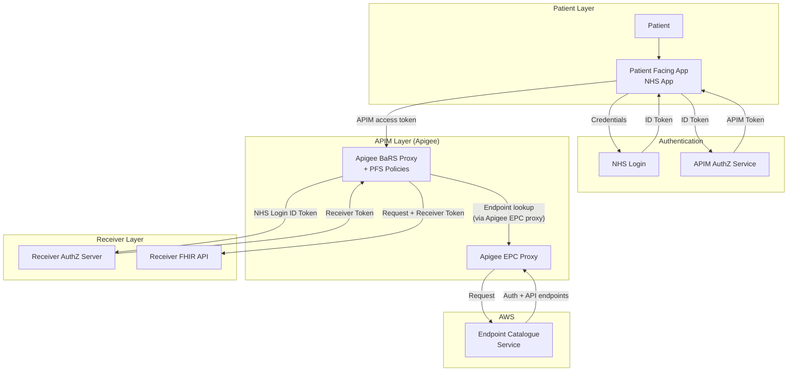
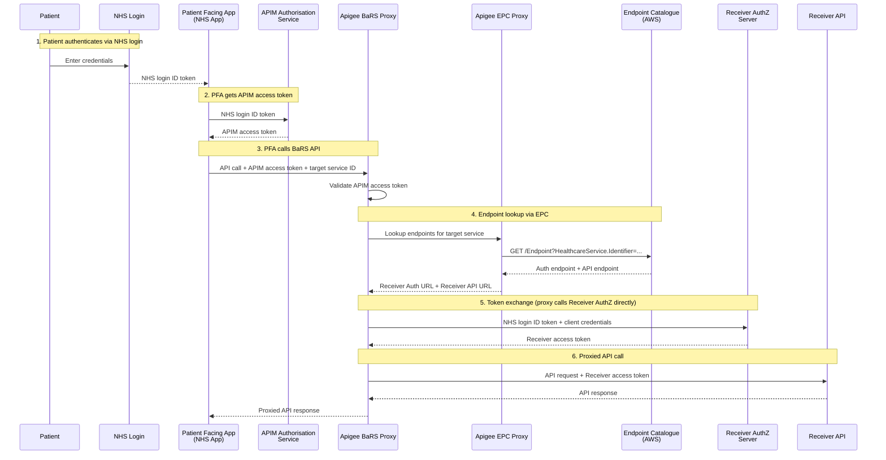
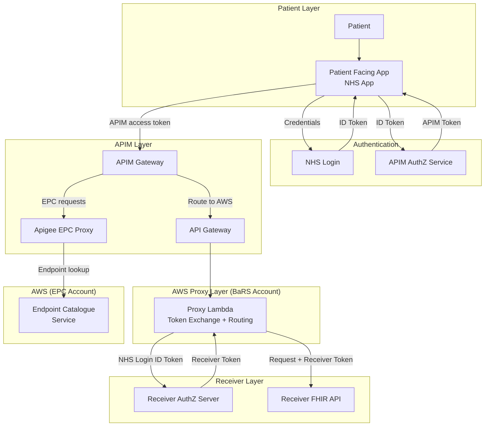
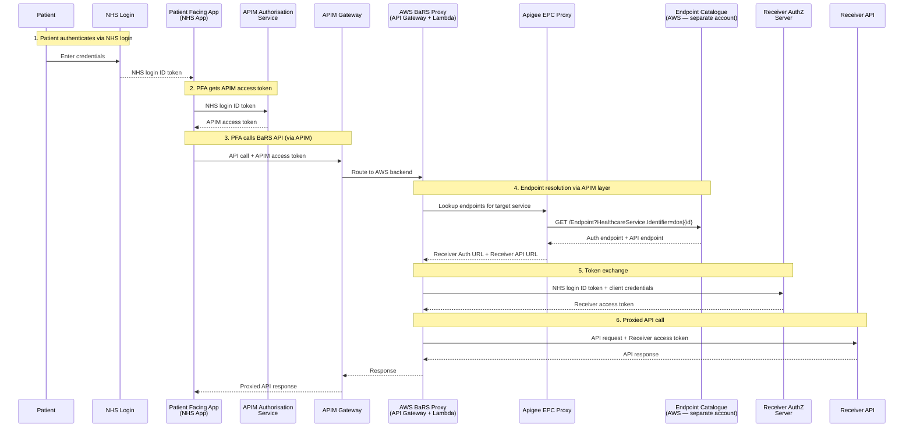

# ADR-060: Patient-Facing Authentication for BaRS Appointment Interactions

## Overview

This ADR records the decision on how patient-facing authentication will be introduced to the BaRS (Booking and Referral Standard) proxy to enable citizens to book, view, and cancel their own appointments directly through the NHS App.

The objective is to establish an authentication and authorisation pattern that:

- enables patients to authenticate as themselves via NHS login and act on their own record
- reuses the proven separate authentication and authorisation pattern from GP Connect Patient Facing Services
- maintains APIM as a single trusted origin for Receiver systems
- minimises Receiver integration burden
- unlocks patient-facing capabilities across multiple NHS programmes (National Diagnostic Service, Self-Referral, Screening, Vaccination booking)
- can be delivered incrementally, with an interim tactical solution on the existing Apigee proxy and a longer-term evolution to an AWS-based proxy


| Field               | Value                                                                                                                                                                                              |
| ---------------------| ----------------------------------------------------------------------------------------------------------------------------------------------------------------------------------------------------|
| **Date**            | 04/08/2026                                                                                                                                                                                         |
| **Status**          | Proposed                                                                                                                                                                                           |
| **Deciders**        | Architecture, Engineering, Solution Assurance, Technical Review and Governance, Cyber Security, Information Governance                                                                             |
| **Significant**     | Interfaces, Nonfunctional characteristics, Dependencies, Structure                                                                                                                                 |
| **Owners**          | [@Richard Ward](https://nhsd-confluence.digital.nhs.uk/display/~richard.ward23@nhs.net)                                                                                                            |
| **Decision**        | _Pending_                                                                                                                                                                                          |
| **Decision waiver** | Approved as a tactical solution with known scalability limitations. Longer-term solution (Option 2 — AWS proxy) to be delivered alongside EPC programme. Tech Debt record to be created. |

---

## 2.1 Context

The Booking and Referral Standard (BaRS) currently supports appointment management (searching slots, booking, viewing, updating, and cancelling appointments) in a business-to-business (B2B) context only. Healthcare systems call each other on behalf of clinicians and operators using application-restricted (system-to-system) credentials. There is no mechanism for a patient to authenticate as themselves and act on their own record.

Multiple NHS programmes require patient-facing appointment capabilities through the NHS App — including the GP Appointment Management, National Diagnostic Service, All Appointments in the App, Self-Referral, Screening, and Vaccination booking. All of these are blocked by the absence of patient authentication support in BaRS.

The core BaRS Appointment Management API is built and in production. The missing capability is an authentication layer that supports citizen-initiated (B2C) requests using NHS login identity tokens.

### Relationship to other decisions

- **[PFS D6 — Auth Token Exchange (Clinical Data Sharing APIs)](https://nhsd-confluence.digital.nhs.uk/spaces/DCA/pages/524888850/PFS+D6+-+Auth+Token+Exchange):** Establishes the APIM token exchange pattern for GP Connect Patient Facing Services. This ADR proposes reusing the same architectural pattern for BaRS.
- **[PFS D5 — Authentication](https://nhsd-confluence.digital.nhs.uk/spaces/DCA/pages/524888840/PFS+D5+-+Authentication):** NHS login as end-to-end authentication for PFS APIs.
- **[EPC Migration](https://nhsd-confluence.digital.nhs.uk/spaces/RA/pages/1273342161/BaRS+Endpoint+Catalogue):** The BaRS proxy is migrating from static `targets.json` routing to dynamic endpoint resolution via the Endpoint Catalogue. Both workstreams touch the same proxy codebase.

### Constraints

- The current BaRS Proxy (Apigee-hosted) has no token exchange capability and uses static `targets.json` routing. The proxy logs transactions via Splunk (as it does today for B2B); GDPR and audit responsibilities sit with the Receiver (target system), not the proxy.
- The Endpoint Catalogue (EPC) is a hard dependency for all options at production scale — `targets.json` is a one-dimensional lookup (service ID → single URL) and cannot support the two-endpoint model (auth URL + API URL per Receiver). Interim workarounds exist for development and limited pilot use but are not scalable.

---

## 2.2 Decision

### 2.2.1 Assumptions


| ID | Assumption                                                                                                                                                                                 | Impact if wrong                                                                                                                 |
| ---- | -------------------------------------------------------------------------------------------------------------------------------------------------------------------------------------------- | --------------------------------------------------------------------------------------------------------------------------------- |
| A1 | NHS login will support P9 (high) identity verification for PFS patients at scale                                                                                                           | PFS cannot launch — identity assurance level is a hard requirement                                                             |
| A2 | APIM will continue to be the public-facing entry point even after the proxy moves to AWS (APIM routes to the new proxy backend)                                                            | If APIM is bypassed, the PFA would need to call AWS directly — different onboarding model, different TLS, different domain     |
| A3 | Receivers will implement a standards-based OAuth2 authorisation server that accepts NHS login ID tokens from APIM                                                                          | If Receivers use proprietary auth mechanisms, bespoke integrations are needed per supplier                                      |
| A4 | The Endpoint Catalogue will support`connectionType` and `payloadType` filtering to distinguish auth endpoints from API endpoints. If EPC is not ready, an interim workaround will be used. | If EPC is delayed and no workaround is in place, PFS cannot resolve Receiver auth endpoints — blocking token exchange entirely |
| A5 | The `NHSD-End-User-Organisation` header will be accepted with the APIM platform ODS code (X26) by existing Receivers without requiring spec changes                                         | If Receivers reject this value, a spec change or per-Receiver negotiation is needed                                             |

### 2.2.2 Drivers

1. **Platform enablement:** Patient authentication through BaRS removes a single blocker for multiple patient-facing digital services (NHS App appointments, National Diagnostic Service, Self-Referral, Screening, Vaccination booking).
2. **Proven pattern reuse:** The NHS login separate authentication and authorisation pattern is already established and proven in GP Connect Patient Facing Services.
3. **Existing API readiness:** The BaRS Appointment Management API already supports all required operations — only the authentication layer is missing.

### 2.2.3 Criteria


| #  | Criterion                      | Description                                                                                                                                    |
| ---- | -------------------------------- | ------------------------------------------------------------------------------------------------------------------------------------------------ |
| C1 | **Security**                   | Patient identity must be cryptographically verified; own-record-only access must be enforced; abuse prevention (rate limiting, bot prevention) |
| C2 | **Standards compliance**       | Must follow established NHS patterns (NHS login separate auth, FHIR R4, BaRS specification)                                                    |
| C3 | **Receiver burden**            | Minimise integration effort for Receiver suppliers; single trusted origin preferred                                                            |
| C4 | **Operational sustainability** | Solution should be maintainable within existing platform capabilities                                                                          |
| C5 | **Scalability**                | Must support the full estate of BaRS Receivers without per-supplier manual configuration                                                       |
| C6 | **Delivery risk**              | Consider dependencies, team capacity, and phased delivery options                                                                              |
| C7 | **Backwards compatibility**    | Must not break existing B2B BaRS flows                                                                                                         |
| C8 | **Strategic alignment**        | Should align with NHS England platform direction and the EPC programme                                                                         |

### 2.2.4 Options

#### Option 1 — Extend the existing Apigee proxy

Add patient-facing support to the current Apigee-hosted BaRS Proxy. The proxy handles the token exchange directly with the Receiver's AuthZ server (no intermediate Lambda). Endpoint resolution uses the Endpoint Catalogue (EPC), which resides in AWS but is accessed via an Apigee proxy.

##### Architecture — Option 1







| Criterion                  | Assessment                                                                                               |
| ---------------------------- | ---------------------------------------------------------------------------------------------------------- |
| Security                   | Token exchange handled directly by proxy using Apigee policies                                           |
| Receiver burden            | Low — single proxy                                                                                      |
| Operational sustainability | Adequate — Apigee is the established platform                                                            |
| Scalability                | Good — dynamic endpoint resolution via EPC (accessed through Apigee EPC proxy)                           |
| Delivery risk              | Low — uses existing platform and team knowledge; depends on APIM team capacity for policy changes       |
| Backwards compatibility    | Good — B2B flows unchanged                                                                              |
| Regulatory compliance      | N/A at proxy level — GDPR and audit responsibilities sit with the Receiver (target system). Proxy logs transactions as it does today. |
| Strategic alignment        | Good — extends existing platform; aligns with incremental delivery                                      |

**Effort: M (Medium)**

#### Option 2 — Build a new AWS proxy supporting both B2B and B2C (phased migration)

Replatform the BaRS Proxy to AWS (API Gateway + Lambda), designed from the start to support both B2B and patient-facing flows. Phased delivery: PFS traffic first, then migrate B2B traffic.

##### Architecture — Option 2








| Criterion                  | Assessment                                                                        |
| ----------------------------| -----------------------------------------------------------------------------------|
| Security                   | Purpose-built for token exchange                                                  |
| Receiver burden            | Low — single trusted origin (APIM); same pattern as GP Connect PFS                |
| Operational sustainability | Good — purpose-built on AWS with CloudWatch for operational logging               |
| Scalability                | Good — dynamic endpoint resolution via EPC                                        |
| Delivery risk              | Medium-High — requires building a new service and phased migration                |
| Backwards compatibility    | Good — phased approach means B2B traffic remains on Apigee until new proxy proven |
| Regulatory compliance      | N/A at proxy level — GDPR and audit responsibilities sit with the Receiver        |
| Strategic alignment        | Good — aligns with EPC migration and longer-term platform evolution               |

**Effort: L (Large)**

### 2.2.5 Recommendation

**Option 1 — Extend the existing Apigee proxy** is recommended as the tactical, near-term solution to unblock patient-facing capabilities, with **Option 2 — New AWS proxy with phased migration** as the strategic longer-term target.

The rationale for this sequencing:

- Option 1 delivers patient-facing authentication capability sooner, using the existing platform and team knowledge, without waiting for a full proxy replatforming effort.
- Option 2 remains the strategic direction and should be planned in parallel, with migration to the new proxy once it is proven and the EPC is production-ready.
- The work done in Option 1 (token exchange logic, Receiver onboarding, scope model definition) is not throwaway — it informs and de-risks the Option 2 build.

**Decision waiver:** Option 1 is approved as a tactical solution. The strategic solution (Option 2 — AWS proxy replatforming) should be delivered as part of the broader EPC migration programme. A Tech Debt record must be created to track this transition.

This is a **reversible** decision. Option 1 can be superseded by Option 2 once the new proxy is delivered, with traffic cut over in a phased manner.

### 2.2.6 Rationale


| Criterion                     | Option 1 (Extend Apigee)   | Option 2 (New AWS, phased) |
| ------------------------------- | ---------------------------- | ---------------------------- |
| C1 Security                   | Adequate                   | Strong                     |
| C2 Standards                  | Adequate                   | Strong                     |
| C3 Receiver burden            | Low                        | Low                        |
| C4 Operational sustainability | Adequate                   | Good                       |
| C5 Scalability                | Good (via EPC)             | Good                       |
| C6 Delivery risk              | Low                        | Medium-High                |
| C7 Backwards compatibility    | Good                       | Good (phased)              |
| C8 Strategic alignment        | Good                       | Good                       |

Option 1 is recommended as the near-term approach because it has the lowest delivery risk (C6), maintains full backwards compatibility (C7), can be delivered using existing platform knowledge and team capacity, and aligns with the current platform (C8). Both options use the EPC for endpoint resolution, so scalability (C5) is equivalent.

Option 2 addresses all criteria strongly and remains the longer-term target. However, its higher delivery risk and dependency on EPC completion make it unsuitable as the immediate next step when patient-facing capabilities are needed sooner.

**Note on audit and GDPR:** GDPR compliance and audit responsibilities for patient data sit with the Receiver (target system), not the proxy. The proxy logs transactions for operational purposes (as it does today for B2B traffic). This ADR does not introduce new audit requirements for the proxy layer.

---

## 2.3 Consequences

### Positive

- Unblocks patient-facing appointment capabilities quickly by extending the existing, proven Apigee proxy platform.
- Lower delivery risk — uses existing platform and team knowledge; no new service to build and operate immediately.
- Establishes a reusable patient authentication pattern for BaRS — the token exchange logic, scope model, and Receiver onboarding process will carry forward to the strategic proxy.
- Reduces Receiver burden by maintaining APIM as a single trusted origin — Receivers only trust one party, not every PFA individually.
- No impact on existing B2B flows — changes are additive to the current proxy.
- De-risks Option 2 — the operational experience gained from running PFS on Apigee informs the design of the strategic AWS proxy.

### Negative / Trade-offs

- **EPC dependency** — endpoint resolution relies on the EPC being available (accessed via the Apigee EPC proxy). If EPC is not production-ready, interim workarounds (see below) are needed for early development and pilot.
- **Coordination required** — both PFS and EPC migration touch the same proxy codebase; must be actively coordinated.
- **Tech debt created** — Option 1 delivery creates tech debt that must be retired when Option 2 is delivered. A Tech Debt record is required.
- **Open design decisions remain** — `NHSD-End-User-Organisation` header handling, OAuth scope model, Receiver AuthZ server contract, and delegated access model all require further resolution.
- **APIM team dependency** — changes to Apigee proxies depend on the platform team's capacity.

### Conditions under which this decision no longer applies

- If the Option 2 strategic proxy is delivered and PFS traffic is successfully migrated to it.
- If a centrally-provided patient-facing proxy capability is delivered by another programme that BaRS could reuse.
- If patient-facing appointment requirements are withdrawn or descoped.

---

## 2.4 Compliance

### Success measures


| Measure                                                                 | Target                             | Method                                     |
| ------------------------------------------------------------------------- | ------------------------------------ | -------------------------------------------- |
| Patient can authenticate and book an appointment via NHS App end-to-end | Functional in INT environment      | Integration test suite                     |
| Token exchange latency                                                  | < 500ms p95                        | CloudWatch metrics                         |
| Own-record enforcement                                                  | Zero cross-patient access          | Penetration testing + automated validation |
| Receiver onboarding (first Receiver)                                    | Medicus live on PFS                | Assurance process completion               |
| B2B traffic unaffected                                                  | Zero regression in B2B error rates | Existing monitoring dashboards             |

### Fitness function

- Automated integration tests in the INT environment that exercise the full patient-facing flow (NHS login → APIM token → token exchange → Receiver API call).
- Security scan: periodic penetration test of the patient-facing endpoint to verify own-record enforcement and abuse prevention controls.

---

## 2.5 Notes

### Related artefacts

- [Patient-Facing BaRS — Technical Paper (WIP)](https://github.com/RichardWardNHSD/BaRS-Appointments-StandardPattern/blob/main/08-patient-facing-nhs-identity.md)
- [PFS D6 — Auth Token Exchange](https://nhsd-confluence.digital.nhs.uk/display/DCA/PFS+D6+-+Auth+Token+Exchange)
- [PFS D5 — Authentication](https://nhsd-confluence.digital.nhs.uk/display/DCA/PFS+D5+-+Authentication)
- [PFS D1 — Endpoint lookup and resolution](https://nhsd-confluence.digital.nhs.uk/spaces/DCA/pages/520341345/PFS+D1+-+Endpoint+lookup+and+resolution)
- [NHS login separate auth and authorisation (developer guide)](https://digital.nhs.uk/developer/guides-and-documentation/security-and-authorisation/user-restricted-restful-apis-nhs-login-separate-authentication-and-authorisation)
- [NHS API Producer Guidance (National Proxy Service)](https://nhsdigital.github.io/national-proxy-service-integration-docs/patient-facing-journeys/api-producer-guidance)
- [NHS Digital Software Engineering Quality Framework — ADR Template](https://github.com/NHSDigital/software-engineering-quality-framework/blob/main/any-decision-record-template.md)
- [Tech Debt guidance](https://github.com/NHSDigital/software-engineering-quality-framework/blob/main/tech-debt.md)

### Blocking dependencies

### Blocking dependencies


| ID | Dependency                                                                                         | Status      | Impact                                                                                                                                                                                                                                                   |
| ---- | ---------------------------------------------------------------------------------------------------- | ------------- | ---------------------------------------------------------------------------------------------------------------------------------------------------------------------------------------------------------------------------------------------------------- |
| D1 | Endpoint Catalogue (EPC) — multi-endpoint resolution with`connectionType`/`payloadType` filtering | In progress | **Hard dependency for all options** — PFS requires resolution of both an auth endpoint and an API endpoint per Receiver. `targets.json` cannot support this two-endpoint model. If EPC is not delivered, an interim workaround is required (see below). |
| D2 | Token exchange capability in the proxy (Apigee policies for Option 1)                              | Not started | **Blocker** — current Apigee proxy has no token exchange capability; must be added via Apigee policies (e.g. ServiceCallout to Receiver AuthZ server)                                                                                                   |
| D3 | APIM team to apply proxy policy changes for PFS traffic                                            | Not started | Delay risk — APIM team capacity is a constraint                                                                                                                                                                                                         |
| D4 | Receiver suppliers implement AuthZ servers and update firewall rules                               | Not started | Delay — phased rollout; early suppliers first                                                                                                                                                                                                           |

### Interim workarounds for auth endpoint resolution (pre-EPC)

The EPC (D1) is a hard dependency for all options because the current `targets.json` routing file is a one-dimensional lookup (service ID → single URL) with no concept of endpoint types. Patient-facing flows require **two separate endpoints** per Receiver:

1. An **authorisation endpoint** (the Receiver's OAuth2 token exchange URL)
2. A **BaRS API endpoint** (the Receiver's FHIR R4 base URL)

If the EPC is not production-ready when PFS development needs to proceed, the following interim workarounds can unblock early development and a limited pilot. None are suitable for production at scale.

#### Workaround 1 — Extend `targets.json` with an auth key convention

Add a parallel key using a naming convention (e.g. `{dosServiceId}:auth`) that maps the same service to an auth URL:

```json
{
  "2000072489": "https://bars-prod.medicus.thirdparty.nhs.uk/FHIR/R4",
  "2000072489:auth": "https://auth.medicus.thirdparty.nhs.uk/oauth2/token"
}
```


| Pros                                      | Cons                                                    |
| ------------------------------------------- | --------------------------------------------------------- |
| Minimal change to existing infrastructure | Fragile naming convention — no validation, no schema   |
| Can be deployed quickly for pilot         | Does not scale — doubles the number of entries         |
| No dependency on EPC delivery             | Requires custom proxy logic to handle the`:auth` suffix |

#### Workaround 2 — Separate `auth-targets.json` file

Maintain a second JSON file alongside `targets.json` that maps DOS service IDs to auth URLs:

```json
{
  "2000072489": "https://auth.medicus.thirdparty.nhs.uk/oauth2/token"
}
```

The proxy reads both files: `targets.json` for the API URL, `auth-targets.json` for the auth URL.


| Pros                                                 | Cons                                              |
| ------------------------------------------------------ | --------------------------------------------------- |
| Clean separation — no pollution of existing routing | Two files to keep in sync — risk of drift        |
| Existing B2B traffic completely unaffected           | Same manual maintenance problem × 2              |
| Simple to implement                                  | No metadata (connectionType, payloadType, status) |

#### Workaround 3 — Well-known auth URL convention (no lookup)

Require Receivers to publish a `.well-known/smart-configuration` endpoint at a predictable path relative to their FHIR base URL, allowing the auth URL to be derived without a separate lookup.


| Pros                                              | Cons                                                                |
| --------------------------------------------------- | --------------------------------------------------------------------- |
| Zero additional configuration — self-maintaining | Requires all Receivers to host auth on the same domain as their API |
| Aligns with SMART on FHIR discovery               | Not all suppliers can conform; adds runtime HTTP call (latency)     |

#### Workaround 4 — Hardcoded configuration per Receiver

For a limited pilot (1–3 Receivers), hardcode auth URLs in the proxy's configuration (Apigee KVM, environment variables, or Lambda config):

```
RECEIVER_AUTH_MEDICUS=https://auth.medicus.thirdparty.nhs.uk/oauth2/token
```


| Pros                                       | Cons                                                    |
| -------------------------------------------- | --------------------------------------------------------- |
| Simplest possible implementation for pilot | Does not scale beyond a handful of Receivers            |
| No file format changes                     | Requires proxy code/config change for each new Receiver |

#### Workaround recommendation

For **development and INT testing**: Workaround 2 (separate `auth-targets.json`) or Workaround 4 (hardcoded config) — these unblock PFS proxy development with no EPC dependency.

For **a limited production pilot** (2–3 Receivers): Workaround 1 or 2 could work short-term.

For **production at scale**: None of these workarounds are acceptable. The EPC remains the only solution that supports structured metadata, self-service endpoint management, dynamic resolution, and validation that both auth and API endpoints exist for a service. The workarounds should be treated as **scaffolding** — built to unblock development, with a clear plan to remove them once the EPC is live.


| ID | Issue                                                                 | Impact                                                   |
| ---- | ----------------------------------------------------------------------- | ---------------------------------------------------------- |
| I1 | `NHSD-End-User-Organisation` header handling for PFS (Option A/B/C/D) | Blocks Receiver onboarding guidance                      |
| I2 | OAuth scope model for patient-facing BaRS not yet agreed              | Blocks PFA development and Receiver AuthZ implementation |
| I3 | Receiver AuthZ server contract not specified                          | Receivers cannot begin implementation                    |
| I4 | Delegated/proxy access model (parent booking for child) not defined   | Cannot support family/carer scenarios at launch          |

### Risk note

This decision is tactically sound but creates acknowledged tech debt. Option 1 extends the existing Apigee proxy, and the transition to Option 2 (AWS proxy) should be tracked via a Tech Debt record and aligned with the EPC migration programme timeline.

The EPC (D1) is a hard dependency for all options at production scale. If the EPC delivery slips, interim workarounds (Workaround 2 or 4 above) can unblock development and a limited pilot, but they introduce additional tech debt and manual maintenance overhead. The workaround chosen should be documented and treated as scaffolding with a defined removal date.

---

## 2.6 Actions

- [ ] Richard W, 18/08/2026, Confirm `NHSD-End-User-Organisation` header approach with NHS API Platform team and BaRS Core spec owners (Issue I1)
- [ ] Richard W, 18/08/2026, Define and agree OAuth scope model with NHS login and APIM teams (Issue I2)
- [ ] BaRS Architecture, 01/09/2026, Produce Receiver AuthZ server contract specification (Issue I3)
- [ ] BaRS Programme, 15/08/2026, Align PFS timeline with EPC delivery milestones; escalate if EPC slips
- [ ] BaRS Engineering, 15/08/2026, Select and implement interim auth endpoint resolution workaround (Workaround 2 or 4 recommended) to unblock development pending EPC delivery
- [ ] BaRS Engineering, 01/09/2026, Produce technical design for Apigee proxy extension (Option 1 — token exchange via Apigee policies, EPC endpoint resolution via Apigee EPC proxy)
- [ ] BaRS Architecture, 01/10/2026, Produce technical design for AWS proxy (Option 2) aligned with EPC migration
- [ ] BaRS Programme, 01/09/2026, Create Tech Debt record for transition from Option 1 (Apigee) to Option 2 (AWS proxy)
- [ ] BaRS Programme, 01/09/2026, Create Tech Debt record for interim auth endpoint workaround — to be retired when EPC is live
- [ ] BaRS Run & Maintain, 01/10/2026, Engage APIM team for PFS traffic routing and proxy policy changes
