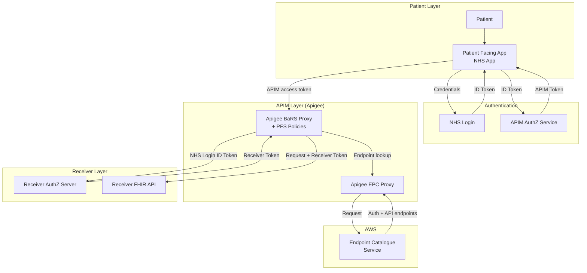
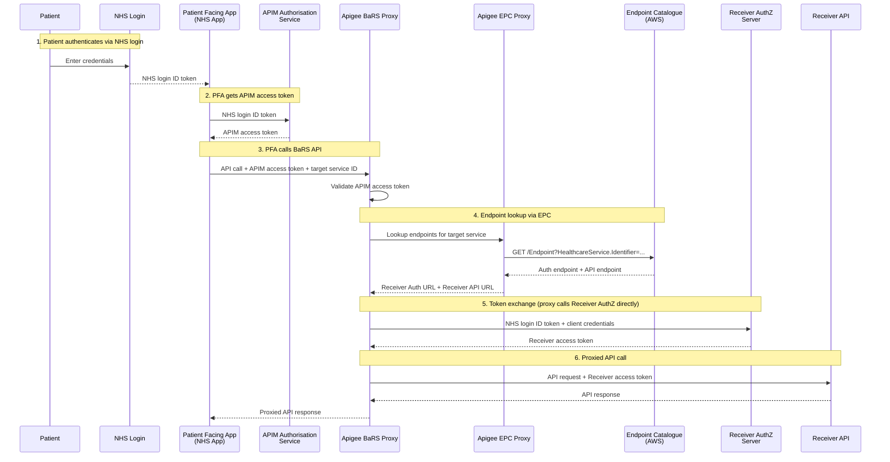

# ADR-060a: Patient-Facing Authentication for BaRS Appointment Interactions

## Overview

This ADR records the decision on how patient-facing authentication will be introduced to the BaRS proxy to enable citizens to book, view, and cancel their own appointments directly through the NHS App.

The approach:

- extends the existing Apigee-hosted BaRS proxy to support patient authentication via NHS login
- reuses the proven separate authentication and authorisation pattern from GP Connect Patient Facing Services (PFS D6)
- uses the Endpoint Catalogue (EPC) for dynamic endpoint resolution, accessed via the existing Apigee EPC proxy
- maintains APIM as a single trusted origin for Receiver systems
- has the proxy handle token exchange directly with Receiver AuthZ servers

> **Out of scope:** Longer-term, the BaRS proxy will be replatformed to AWS (API Gateway + Lambda). That migration is a separate initiative and is not covered by this ADR. The authentication pattern documented here is designed to carry forward to the replatformed proxy without change.

## Metadata

| Field               | Value                                                                                                                  |
|---------------------|------------------------------------------------------------------------------------------------------------------------|
| **Date**            | 04/08/2026                                                                                                             |
| **Status**          | Proposed                                                                                                               |
| **Deciders**        | Architecture, Engineering, Solution Assurance, Technical Review and Governance, Cyber Security                         |
| **Significant**     | Interfaces, Dependencies, Structure                                                                                    |
| **Owners**          | BaRS Architecture (Richard W)                                                                                          |
| **Decision**        | _Pending_                                                                                                              |
| **Decision waiver** | —                                                                                                                      |

---

## Context

The Booking and Referral Standard (BaRS) currently supports appointment management in a business-to-business (B2B) context only. Healthcare systems call each other on behalf of clinicians using application-restricted (system-to-system) credentials. There is no mechanism for a patient to authenticate as themselves and act on their own record.

Multiple NHS programmes require patient-facing appointment capabilities through the NHS App — including GP Appointment Management, National Diagnostic Service, All Appointments in the App, Self-Referral, Screening, and Vaccination booking. All are blocked by the absence of patient authentication in BaRS.

The core BaRS Appointment Management API is built and in production. The missing capability is an authentication layer that supports citizen-initiated (B2C) requests using NHS login identity tokens.

### Relationship to other decisions

- **[PFS D6 — Auth Token Exchange](https://nhsd-confluence.digital.nhs.uk/display/DCA/PFS+D6+-+Auth+Token+Exchange):** Establishes the APIM token exchange pattern for GP Connect Patient Facing Services. This ADR reuses the same pattern.
- **[PFS D5 — Authentication](https://nhsd-confluence.digital.nhs.uk/display/DCA/PFS+D5+-+Authentication):** NHS login as end-to-end authentication for PFS APIs.
- **[EPC Migration](https://nhsd-confluence.digital.nhs.uk/spaces/RA/pages/1273342161/BaRS+Endpoint+Catalogue):** The BaRS proxy is migrating from static `targets.json` routing to dynamic endpoint resolution via the Endpoint Catalogue.

### Constraints

- The current BaRS Proxy (Apigee-hosted) has no token exchange capability today — this must be added.
- The Endpoint Catalogue (EPC) resides in AWS but is accessed via an Apigee EPC proxy — no cross-AWS-account access.
- GDPR and audit responsibilities for patient data sit with the Receiver (target system), not the proxy. The proxy logs transactions for operational purposes as it does today.

---

## Decision

### Assumptions

| ID | Assumption | Impact if wrong |
|----|-----------|-----------------|
| A1 | NHS login will support P9 (high) identity verification for PFS patients at scale | PFS cannot launch — identity assurance level is a hard requirement |
| A2 | APIM will continue to be the public-facing entry point for BaRS | If APIM is bypassed, a different onboarding model is needed |
| A3 | Receivers will implement a standards-based OAuth2 authorisation server that accepts NHS login ID tokens from APIM | If Receivers use proprietary auth, bespoke integrations are needed per supplier |
| A4 | The Endpoint Catalogue will support `connectionType` and `payloadType` filtering to distinguish auth endpoints from API endpoints | If not, an alternative discovery mechanism is needed |
| A5 | The `NHSD-End-User-Organisation` header will be accepted with the APIM platform ODS code (X26) by existing Receivers | If Receivers reject this value, a spec change or per-Receiver negotiation is needed |

### Drivers

1. **Platform enablement:** Patient authentication through BaRS removes a single blocker for multiple patient-facing digital services.
2. **Proven pattern reuse:** The NHS login separate authentication and authorisation pattern is established and proven in GP Connect Patient Facing Services (PFS D6).
3. **Existing API readiness:** The BaRS Appointment Management API already supports all required operations — only the authentication layer is missing.
4. **Coordination with EPC:** Both PFS and EPC touch the same proxy codebase. They should be treated as a single proxy evolution.

### Approach

Extend the existing Apigee-hosted BaRS Proxy to support patient-facing authentication. The proxy handles token exchange directly with Receiver AuthZ servers using Apigee policies (ServiceCallout). Endpoint resolution uses the Endpoint Catalogue via the Apigee EPC proxy.

#### Architecture

#### Sequence

#### Key design points

- **The PFA only ever communicates with APIM.** APIM handles endpoint discovery, token exchange with the Receiver, and request proxying.
- **The Receiver only needs to trust APIM** as a single origin — individual PFAs are never registered directly with Receivers.
- **Token exchange is handled by Apigee policies** (ServiceCallout to the Receiver's AuthZ server). No intermediate Lambda.
- **Endpoint resolution uses the EPC** (via the Apigee EPC proxy). The EPC provides both the auth endpoint and the API endpoint for each Receiver, distinguished by `connectionType`.
- **Own-record enforcement:** The patient's NHS Number is derived from the NHS login ID token. The Receiver must validate that the patient can only act on their own record.
- **`NHSD-End-User-Organisation` header:** Carries the APIM platform identity (ODS code X26) for patient-facing flows, not the patient's organisation.

---

## Consequences

### Positive

- Unblocks patient-facing appointment capabilities by extending the existing, proven Apigee proxy platform.
- Low delivery risk — uses existing platform and team knowledge.
- Establishes a reusable patient authentication pattern for BaRS that will carry forward to the replatformed proxy.
- Reduces Receiver burden — APIM is a single trusted origin; Receivers don't onboard individual PFAs.
- No impact on existing B2B flows — changes are additive.

### Negative / Trade-offs

- **EPC dependency** — endpoint resolution relies on the EPC being available via the Apigee EPC proxy. If EPC is not production-ready, interim workarounds are needed (see below).
- **Coordination required** — both PFS and EPC migration touch the same proxy codebase.
- **APIM team dependency** — changes to Apigee proxies depend on the platform team's capacity.
- **Open design decisions remain** — `NHSD-End-User-Organisation` header handling, OAuth scope model, and Receiver AuthZ server contract all require further resolution.

---

## Compliance

### Success measures

| Measure | Target | Method |
|---------|--------|--------|
| Patient can authenticate and book an appointment via NHS App end-to-end | Functional in INT environment | Integration test suite |
| Token exchange latency | < 500ms p95 | Monitoring |
| Own-record enforcement | Zero cross-patient access | Penetration testing + automated validation |
| Receiver onboarding (first Receiver) | Medicus live on PFS | Assurance process completion |
| B2B traffic unaffected | Zero regression in B2B error rates | Existing monitoring dashboards |

---

## Notes

### Related artefacts

- [Patient-Facing BaRS — Technical Paper (WIP)](https://github.com/RichardWardNHSD/BaRS-Appointments-StandardPattern/blob/main/08-patient-facing-nhs-identity.md)
- [PFS D6 — Auth Token Exchange](https://nhsd-confluence.digital.nhs.uk/display/DCA/PFS+D6+-+Auth+Token+Exchange)
- [PFS D5 — Authentication](https://nhsd-confluence.digital.nhs.uk/display/DCA/PFS+D5+-+Authentication)
- [PFS D1 — Endpoint lookup and resolution](https://nhsd-confluence.digital.nhs.uk/spaces/DCA/pages/520341345/PFS+D1+-+Endpoint+lookup+and+resolution)
- [NHS login separate auth and authorisation (developer guide)](https://digital.nhs.uk/developer/guides-and-documentation/security-and-authorisation/user-restricted-restful-apis-nhs-login-separate-authentication-and-authorisation)

### Dependencies

| ID | Dependency | Status | Impact |
|----|-----------|--------|--------|
| D1 | Endpoint Catalogue (EPC) — multi-endpoint resolution with `connectionType`/`payloadType` filtering | In progress | **Hard dependency** — PFS requires resolution of both an auth endpoint and an API endpoint per Receiver. If EPC is not delivered, an interim workaround is required. |
| D2 | Token exchange capability added to the Apigee BaRS proxy (ServiceCallout policies) | Not started | **Blocker** — current proxy has no token exchange capability |
| D3 | APIM team to apply proxy policy changes for PFS traffic | Not started | Delay risk — APIM team capacity is a constraint |
| D4 | Receiver suppliers implement AuthZ servers | Not started | Delay — phased rollout; early suppliers first |

### Interim workarounds for auth endpoint resolution (pre-EPC)

If the EPC is not production-ready when PFS development needs to proceed, the following can unblock early development:

| Workaround | Description | Suitability |
|-----------|-------------|-------------|
| Separate `auth-targets.json` | A second JSON file mapping DOS service IDs to auth URLs, read alongside `targets.json` | Development / INT testing |
| Hardcoded config per Receiver | Auth URLs in Apigee KVM or environment variables for 1–3 pilot Receivers | Limited pilot |

These are scaffolding — to be removed once the EPC is live.

### Open issues

| ID | Issue | Impact |
|----|-------|--------|
| I1 | `NHSD-End-User-Organisation` header handling for PFS not yet confirmed | Blocks Receiver onboarding guidance |
| I2 | OAuth scope model for patient-facing BaRS not yet agreed | Blocks PFA development and Receiver AuthZ implementation |
| I3 | Receiver AuthZ server contract not specified | Receivers cannot begin implementation |
| I4 | Delegated/proxy access model (parent booking for child) not defined | Cannot support family/carer scenarios at launch |

---

## Actions

- [ ] Richard W, 18/08/2026, Confirm `NHSD-End-User-Organisation` header approach with NHS API Platform team and BaRS Core spec owners (I1)
- [ ] Richard W, 18/08/2026, Define and agree OAuth scope model with NHS login and APIM teams (I2)
- [ ] BaRS Architecture, 01/09/2026, Produce Receiver AuthZ server contract specification (I3)
- [ ] BaRS Programme, 15/08/2026, Align PFS timeline with EPC delivery milestones
- [ ] BaRS Engineering, 15/08/2026, Select and implement interim auth endpoint workaround to unblock development pending EPC
- [ ] BaRS Engineering, 01/09/2026, Produce technical design for Apigee proxy extension (token exchange via ServiceCallout, EPC endpoint resolution)
- [ ] BaRS Run & Maintain, 01/10/2026, Engage APIM team for PFS traffic routing and proxy policy changes
