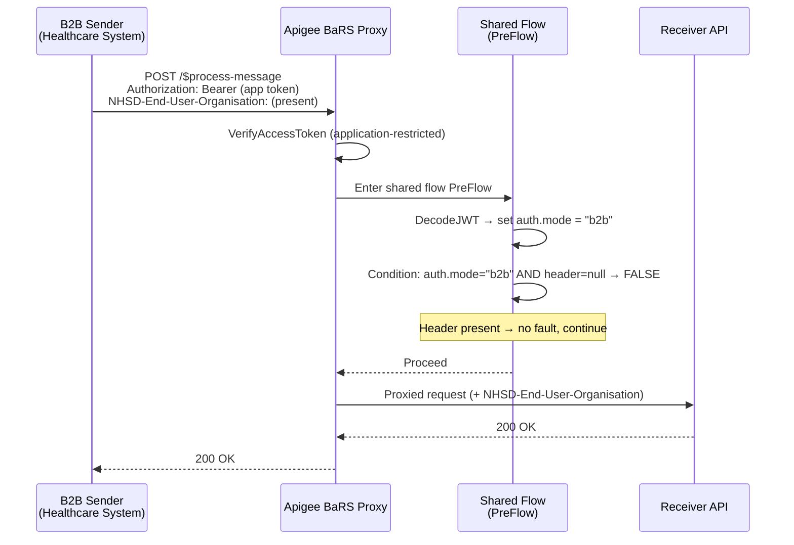
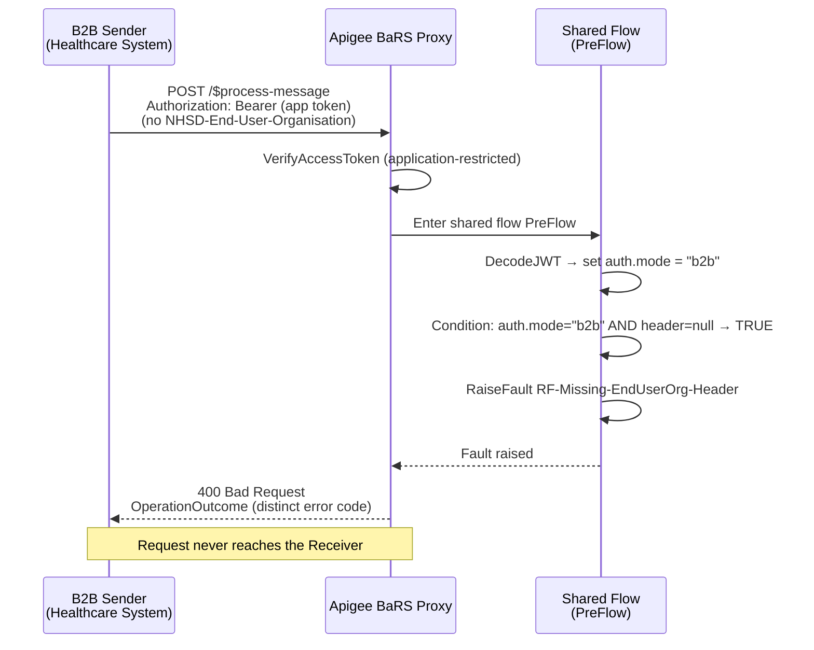
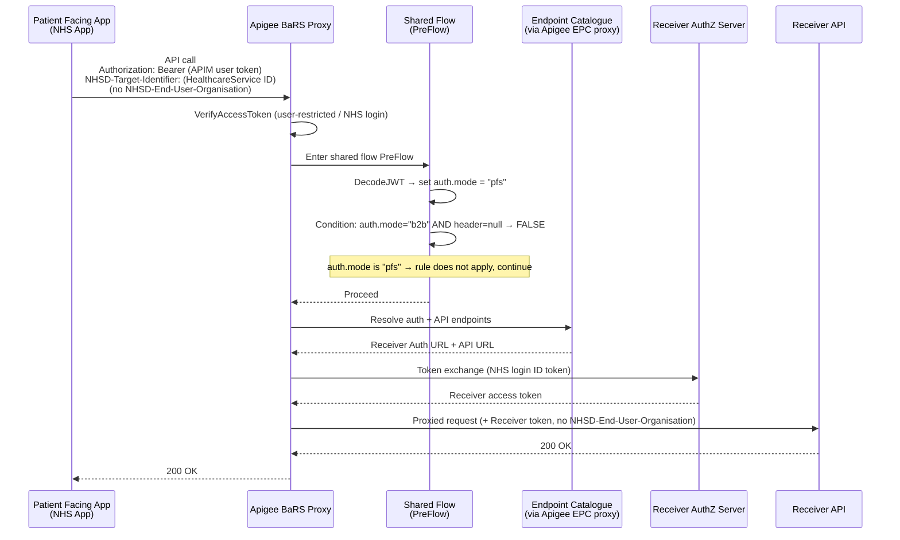
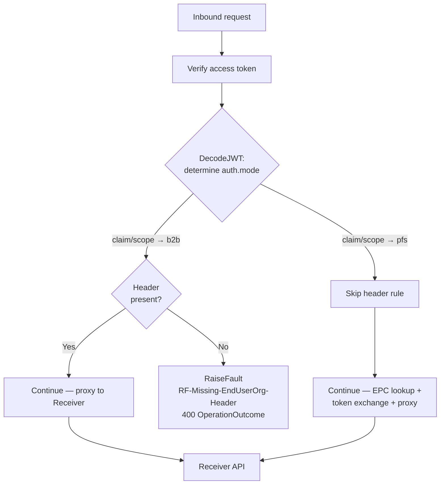

# ADR-060c — Option C: Conditional `NHSD-End-User-Organisation` Enforcement

> **Parent ADR:** [ADR-060c — Patient-Facing Authentication for BaRS Appointment Interactions](./ADR-060c-Patient-Facing-BaRS-Authentication.md)
>
> This sub-page provides the detailed design and technical implementation of **Option C** — making the `NHSD-End-User-Organisation` header **optional for patient-facing (PFS) flows and mandatory for B2B**, enforced conditionally at the Apigee proxy layer. It is a companion to the parent ADR and does not restate the decision rationale; see the parent ADR's "Handling `NHSD-End-User-Organisation`" section for why Option C is preferred over Options A, B, and D.

---

## 1. Summary

| Aspect | Detail |
|--------|--------|
| **Rule** | `NHSD-End-User-Organisation` is **mandatory** for B2B (application-restricted) requests and **optional** (expected absent) for patient-facing (user-restricted) requests |
| **Enforcement point** | Apigee BaRS proxy — request `PreFlow` in a shared flow |
| **Decision input** | `auth.mode` flow variable, derived from a claim/scope in the validated access token |
| **B2B behaviour** | Unchanged — header still required; missing header → fault |
| **PFS behaviour** | Header omitted; patient identity carried in the token chain, not the header |
| **Failure mode** | Distinct, self-diagnosing FHIR `OperationOutcome` (not a generic 400) |
| **Source of truth** | The Apigee policy (OAS cannot express a runtime, auth-context-dependent rule) |

---

## 2. Why this can't live in the OAS contract

OpenAPI can declare a header as `required: true` or `required: false`, but it **cannot** express *"required only when the caller is B2B."* The requirement depends on runtime auth context — which token was presented and what it asserts. That determination is only available after token validation, inside the proxy.

Consequently:

- The **OAS contract** documents the header as *conditionally required* (with prose describing the rule) but cannot enforce it.
- The **Apigee proxy** is the actual enforcement point and therefore the **source of truth** for the rule.
- The **BaRS conformance documentation** must describe the rule and the exact error response so Receivers and Senders can self-diagnose.

These three artefacts must be kept in sync. The proxy policy naming and comments should cross-reference this ADR so a future reviewer does not have to reverse-engineer the rule from XML.

---

## 3. Determining auth mode (`auth.mode`)

The conditional rule hinges entirely on reliably distinguishing a **B2B** request from a **patient-facing** request. This is the harder part of the design — the header check itself is trivial once `auth.mode` is known.

### 3.1 Candidate signals

| Signal | B2B value | PFS value | Reliability |
|--------|-----------|-----------|-------------|
| `grant_type` claim | `client_credentials` | token-exchange / NHS login flow | Good, if surfaced as a claim in the access token |
| `scope` | application scopes (e.g. `.../booking-and-referral`) | user scope (e.g. `urn:nhsd:apim:user-nhs-login:aal3:booking-and-referral/patient-access`) | Good — PFS scopes are distinct and unambiguous |
| Custom claim | e.g. `auth_level: application` | e.g. `auth_level: user` | Best if the platform can guarantee it |
| Token issuer / identity provider | CIS2 / app platform | NHS login | Good, if issuer differs by flow |

### 3.2 Preferred mechanism

Inspect a **claim or scope in the validated access token** using a `DecodeJWT` policy and set `auth.mode` from it. The presence of an NHS-login user scope (e.g. a `patient/...` or `user-nhs-login` scope) is the most unambiguous signal, because those scopes are only ever issued to patient-facing applications.

### 3.3 Anti-pattern to avoid

**Do not** infer `auth.mode` from *which verification policy path executed*. If B2B and PFS flows share steps, or the flow structure is later refactored, path-based inference silently breaks. Always derive `auth.mode` from token content, which is stable regardless of flow structure.

> **Open issue I1 (parent ADR):** The authoritative claim/scope that distinguishes the two modes must be confirmed with the APIM / NHS Login teams and specified as the sole input to `auth.mode`. See Action A8.

---

## 4. Sequence diagrams

### 4.1 B2B request — header present (happy path)



### 4.2 B2B request — header missing (rejected)



### 4.3 Patient-facing (PFS) request — header absent (accepted)



### 4.4 Decision flow (both modes)



---

## 5. Apigee implementation

### 5.1 Where the logic lives

Implement the check as a **request step in a shared flow `PreFlow`**, so it applies uniformly and can be reused across proxies/operations that share the rule.

```
BaRS Proxy
└── PreFlow (proxy endpoint)
    └── FlowCallout → SF-Auth-Context-Guard   (shared flow)
        ├── Step: DecodeJWT-AccessToken       (sets decoded.claim.* )
        ├── Step: AM-Set-Auth-Mode            (sets auth.mode from claim/scope)
        └── Step: RF-Missing-EndUserOrg-Header (conditional RaiseFault)
```

### 5.2 Step 1 — Decode the token

```xml
<!--
  Decodes the validated access token so downstream steps can read claims.
  Rule source of truth: ADR-060c Option C (conditional NHSD-End-User-Organisation).
-->
<DecodeJWT name="DecodeJWT-AccessToken">
  <DisplayName>Decode Access Token</DisplayName>
  <Source>request.header.authorization.2</Source>
  <!-- '.2' selects the token after the "Bearer " prefix -->
</DecodeJWT>
```

> **Note:** If token verification (`VerifyJWT` / `OAuthV2 VerifyAccessToken`) already runs earlier and exposes the claims/scopes as flow variables, a separate `DecodeJWT` may be unnecessary — reuse the existing verified claims rather than decoding again. Never make an authorisation decision on an *unverified* token.

### 5.3 Step 2 — Set `auth.mode`

Set `auth.mode` from the authoritative signal (confirmed under Open Issue I1). Example using a scope-based signal:

```xml
<!--
  Sets auth.mode = "pfs" when an NHS-login user scope is present,
  otherwise "b2b". The exact scope/claim is confirmed per ADR-060c Action A8.
-->
<AssignMessage name="AM-Set-Auth-Mode">
  <DisplayName>Set Auth Mode</DisplayName>
  <AssignVariable>
    <Name>auth.mode</Name>
    <!-- default -->
    <Value>b2b</Value>
  </AssignVariable>
  <AssignVariable>
    <Name>auth.mode</Name>
    <!-- Template evaluates to "pfs" if the user scope is present -->
    <Template>{if(jwt.DecodeJWT-AccessToken.claim.scope ~~ "(^|\s)urn:nhsd:apim:user-nhs-login:.*booking-and-referral/patient-access(\s|$)", "pfs", "b2b")}</Template>
  </AssignVariable>
  <IgnoreUnresolvedVariables>true</IgnoreUnresolvedVariables>
</AssignMessage>
```

> The template syntax above is illustrative — the precise scope string and matching approach must be finalised against the agreed scope model (parent ADR I2) and the confirmed `auth.mode` signal (parent ADR I1). Consider a `JavaScript` or `RegularExpressionProtection`-based extraction if the message-template matching proves brittle.

### 5.4 Step 3 — Conditional RaiseFault

Attach the fault step with a `Condition` so it only fires for B2B requests missing the header:

```xml
<Step>
  <Condition>auth.mode = "b2b" and request.header.NHSD-End-User-Organisation = null</Condition>
  <Name>RF-Missing-EndUserOrg-Header</Name>
</Step>
```

The `RaiseFault` policy returns a distinct, self-diagnosing error in the standard NHS/BaRS FHIR `OperationOutcome` format:

```xml
<RaiseFault name="RF-Missing-EndUserOrg-Header">
  <DisplayName>Missing NHSD-End-User-Organisation (B2B)</DisplayName>
  <FaultResponse>
    <Set>
      <StatusCode>400</StatusCode>
      <ReasonPhrase>Bad Request</ReasonPhrase>
      <Headers>
        <Header name="Content-Type">application/fhir+json</Header>
      </Headers>
      <Payload contentType="application/fhir+json">
{
  "resourceType": "OperationOutcome",
  "issue": [
    {
      "severity": "error",
      "code": "required",
      "details": {
        "coding": [
          {
            "system": "https://fhir.nhs.uk/CodeSystem/Spine-ErrorOrWarningCode",
            "code": "MISSING_OR_INVALID_HEADER",
            "display": "There is a required header missing or invalid"
          }
        ]
      },
      "diagnostics": "The NHSD-End-User-Organisation header is mandatory for business-to-business (application-restricted) requests. It is omitted only for patient-facing (user-restricted) requests. See ADR-060c Option C."
    }
  ]
}
      </Payload>
    </Set>
  </FaultResponse>
</RaiseFault>
```

> **Error code alignment:** The exact `code`/`system` values must match the BaRS error vocabulary used elsewhere in the proxy so consumers get a consistent experience. Confirm against the BaRS conformance documentation (parent ADR Action A9).

---

## 6. Header lifecycle across both flows

| Stage | B2B | Patient-facing (PFS) |
|-------|-----|----------------------|
| Sent by caller | `NHSD-End-User-Organisation` present (Base64 Organization) | Header not sent |
| Proxy validation | Rejected (400) if missing | Not required; not injected |
| Sent to Receiver | Forwarded unchanged | Not present |
| Receiver use | Ownership/authorisation, address masking, audit | N/A — patient identity from Receiver access token |
| Patient identity source | Not applicable (org-to-org) | Receiver access token (NHS Number claim), enforced own-record |

**Key point:** In PFS the *absence* of the header is itself the signal that this is a patient-initiated request. The Receiver must not treat a missing header as an error for patient-facing flows — this is the required Receiver-side change (see §8).

---

## 7. Edge cases and failure handling

| Scenario | Expected behaviour |
|----------|--------------------|
| B2B request, header present but malformed (invalid Base64 / not an Organization) | Existing B2B validation applies (unchanged by Option C) — reject per current spec |
| B2B request, header absent | 400 `OperationOutcome` `MISSING_OR_INVALID_HEADER` (the Option C rule) |
| PFS request, header **present** (unexpected) | Recommended: **ignore** the header and do not forward it, OR reject with a distinct code if strict. Decision to be confirmed — see §9. Default recommendation: strip it, log at INFO, proceed as patient-facing. |
| `auth.mode` cannot be determined (claim/scope absent) | Fail closed — treat as B2B and apply the mandatory-header rule, since an unidentifiable caller should not receive the relaxed PFS treatment |
| Token valid but neither B2B nor PFS scope present | Fail closed as above; also a signal that scope configuration (parent ADR I2) is incomplete |

> **Fail-closed principle:** If auth mode is ambiguous, default to the stricter B2B rule. The relaxed (optional-header) treatment should only apply when the request is *positively identified* as patient-facing.

---

## 8. Receiver-side impact

For patient-facing flows, Receivers must adapt so they do not require `NHSD-End-User-Organisation`:

1. **Do not reject** patient-facing requests solely because the header is absent.
2. **Derive patient identity from the Receiver access token** (NHS Number claim), not from the header.
3. **Enforce own-record access** using the token identity.
4. **Audit** the patient identity (from the token) rather than an organisation from the header; record the request as patient-initiated.
5. **Distinguish patient-facing from B2B** on their side using the token type/scope (Receivers receive a patient-scoped access token for PFS vs an application context for B2B).

B2B Receiver behaviour is unchanged — the header remains mandatory and is forwarded as today.

---

## 9. Open questions specific to Option C

| Ref | Question | Links to |
|-----|----------|----------|
| OC-1 | What is the authoritative claim/scope that sets `auth.mode`? | Parent ADR I1 / Action A8 |
| OC-2 | Exact error `code`/`system`/`display` for the missing-header B2B fault | Parent ADR Action A9 |
| OC-3 | If a PFS request *does* carry the header, strip-and-proceed or reject? | §7 — default: strip and proceed |
| OC-4 | Does the BaRS Core spec change describe the header as "conditional" with the auth-mode rule, or simply "optional for user-restricted"? | Parent ADR D6 / Action A1 |
| OC-5 | Is the `auth.mode` signal identical to the one used for GPC PFS, so shared-flow logic can be reused? | Parent ADR (PFS D6 alignment) |

---

## 10. Test scenarios

| # | Given | When | Then |
|---|-------|------|------|
| T1 | B2B token, header present | Request sent | 200 — proxied to Receiver with header |
| T2 | B2B token, header absent | Request sent | 400 `OperationOutcome` `MISSING_OR_INVALID_HEADER` — not proxied |
| T3 | PFS token, header absent | Request sent | 200 — token exchange + proxied, no header forwarded |
| T4 | PFS token, header present | Request sent | Per OC-3 decision (default: header stripped, 200) |
| T5 | Token with no B2B/PFS scope | Request sent | Fail closed — treated as B2B; 400 if header absent |
| T6 | B2B token, malformed header | Request sent | Existing B2B validation error (unchanged) |
| T7 | Rule refactor — flow steps reordered | T1-T6 re-run | Behaviour unchanged (auth.mode is token-derived, not path-derived) |

These should be automated as proxy conformance tests (parent ADR success measure: "Conditional header enforcement correct").

---

## 11. Cross-references

- Parent decision and option comparison: [ADR-060c](./ADR-060c-Patient-Facing-BaRS-Authentication.md) — "Handling `NHSD-End-User-Organisation`"
- Open issues I1 (auth-mode detection), I2 (scope model), I3 (Receiver AuthZ contract): parent ADR
- Dependencies D3 (APIM proxy changes), D6 (BaRS Core spec change): parent ADR
- Actions A1 (agree Option C), A8 (`auth.mode` signal), A9 (error code): parent ADR
- Technical paper: [08-patient-facing-nhs-identity.md](../../08-patient-facing-nhs-identity.md)
