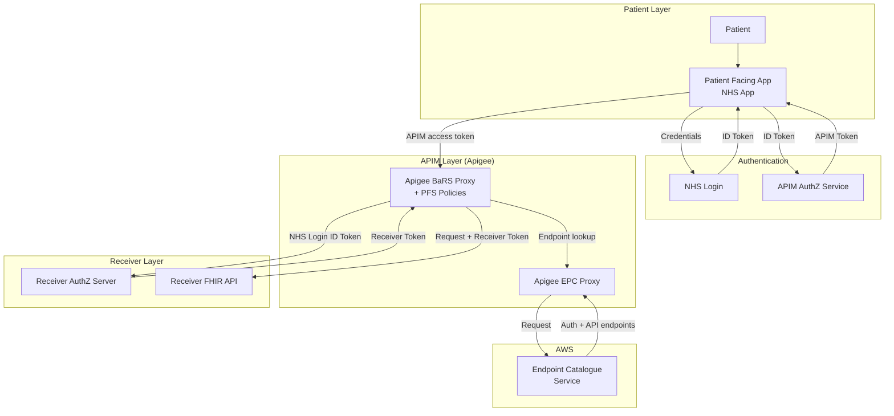
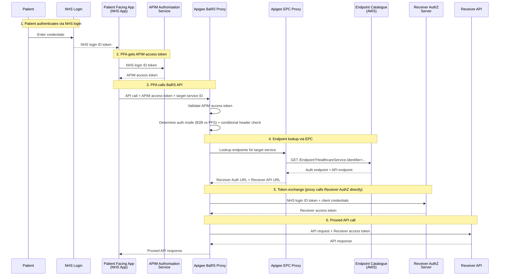

# ADR-060c: Patient-Facing Authentication for BaRS Appointment Interactions

## Overview

This ADR records the decision on how patient-facing authentication will be introduced to the BaRS proxy to enable citizens to book, view, and cancel their own appointments directly through the NHS App.

The approach:

- extends the existing Apigee-hosted BaRS proxy to support patient authentication via NHS login
- reuses the proven separate authentication and authorisation pattern from GP Connect Patient Facing Services (PFS D6)
- uses the Endpoint Catalogue (EPC) for dynamic endpoint resolution, accessed via the existing Apigee EPC proxy
- maintains APIM as a single trusted origin for Receiver systems
- has the proxy handle token exchange directly with Receiver AuthZ servers
- makes the `NHSD-End-User-Organisation` header **optional for patient-facing flows and mandatory for B2B**, enforced conditionally at the Apigee proxy layer

> **Out of scope:** Longer-term, the BaRS proxy will be replatformed to AWS (API Gateway + Lambda). That migration is a separate initiative and is not covered by this ADR. The authentication pattern documented here is designed to carry forward to the replatformed proxy without change.

## Metadata


| Field               | Value                                                                                          |
| ------------------- | ---------------------------------------------------------------------------------------------- |
| **Date**            | 10/08/2026                                                                                     |
| **Status**          | Proposed                                                                                       |
| **Deciders**        | Architecture, Engineering, Solution Assurance, Technical Review and Governance, Cyber Security |
| **Significant**     | Interfaces, Dependencies, Structure                                                            |
| **Owners**          | BaRS Architecture (Richard W)                                                                  |
| **Decision**        | _Pending_                                                                                      |
| **Decision waiver** | —                                                                                              |
| **Supersedes**      | ADR-060b (revises `NHSD-End-User-Organisation` recommendation from Option D to Option C)        |

---

## Context

The Booking and Referral Standard (BaRS) currently supports appointment management in a business-to-business (B2B) context only. Healthcare systems call each other on behalf of clinicians using application-restricted (system-to-system) credentials. There is no mechanism for a patient to authenticate as themselves and act on their own record.

Multiple NHS programmes require patient-facing appointment capabilities through the NHS App — including GP Appointment Management, National Diagnostic Service, All Appointments in the App, Self-Referral, Screening, and Vaccination booking. All are blocked by the absence of patient authentication in BaRS.

The core BaRS Appointment Management API is built and in production. The missing capability is an authentication layer that supports citizen-initiated (B2C) requests using NHS login identity tokens.

### Relationship to other decisions

- **[PFS D6 — Auth Token Exchange](https://nhsd-confluence.digital.nhs.uk/display/DCA/PFS+D6+-+Auth+Token+Exchange):** Establishes the APIM token exchange pattern for GP Connect Patient Facing Services. This ADR reuses the same pattern.
- **[PFS D5 — Authentication](https://nhsd-confluence.digital.nhs.uk/display/DCA/PFS+D5+-+Authentication):** NHS login as end-to-end authentication for PFS APIs.
- **[EPC Migration](https://nhsd-confluence.digital.nhs.uk/spaces/RA/pages/1273342161/BaRS+Endpoint+Catalogue):** The BaRS proxy is migrating from static `targets.json` routing to dynamic endpoint resolution via the Endpoint Catalogue.

### Constraints

- The current BaRS Proxy (Apigee-hosted) has no token exchange capability today — this must be added.
- The Endpoint Catalogue (EPC) resides in AWS but is accessed via an Apigee EPC proxy — no cross-AWS-account access.
- GDPR and audit responsibilities for patient data sit with the Receiver (target system), not the proxy. The proxy logs transactions for operational purposes as it does today. This is consistent with the existing B2B model where:
  - The Receiver is the **data controller/processor** for patient appointment data
  - The proxy operates as a **routing and authentication intermediary** that does not persist patient-identifiable information
  - The proxy logs operational metadata only (request IDs, correlation IDs, response status, latency) — no NHS Numbers, patient names, or clinical content

  > **Note:** This responsibility model is established by precedent in the current B2B BaRS proxy and aligns with the GP Connect PFS proxy model (PFS D6). Formal validation through the IG and DPIA process is required before patient-facing flows go live. See Action A5.

---

## Decision

### Assumptions


| ID  | Assumption                                                                                                                       | Impact if wrong                                                                     |
| --- | -------------------------------------------------------------------------------------------------------------------------------- | ----------------------------------------------------------------------------------- |
| A1  | NHS login will support P9 (high) identity verification for PFS patients at scale                                                 | PFS cannot launch — identity assurance level is a hard requirement                  |
| A2  | APIM will continue to be the public-facing entry point for BaRS                                                                  | If APIM is bypassed, a different onboarding model is needed                         |
| A3  | Receivers will implement a standards-based OAuth2 authorisation server that accepts NHS login ID tokens from APIM                | If Receivers use proprietary auth, bespoke integrations are needed per supplier     |
| A4  | The Endpoint Catalogue will support `connectionType` and `payloadType` filtering to distinguish auth endpoints from API endpoints | If not, an alternative discovery mechanism is needed                                |
| A5  | The auth mode (B2B vs patient-facing) can be reliably distinguished at the proxy from a token claim or scope                     | If not, the conditional header enforcement is fragile — see I1 for mitigation       |
| A6  | The Medicus OAuth2 token endpoint used for GPC PFS can be reused for BaRS PFS token exchange                                     | If not, Medicus must implement a separate AuthZ endpoint — adds delivery time       |
| A7  | The BaRS Core specification can be updated to make `NHSD-End-User-Organisation` conditional (optional for PFS)                    | If the spec change is rejected, a fallback (Option D — APIM platform ODS code) is needed |

### Drivers

1. **Platform enablement:** Patient authentication through BaRS removes a single blocker for multiple patient-facing digital services.
2. **Proven pattern reuse:** The NHS login separate authentication and authorisation pattern is established and proven in GP Connect Patient Facing Services (PFS D6).
3. **Existing API readiness:** The BaRS Appointment Management API already supports all required operations — only the authentication layer is missing.
4. **Coordination with EPC:** Both PFS and EPC touch the same proxy codebase. They should be treated as a single proxy evolution.

### Approach

Extend the existing Apigee-hosted BaRS Proxy to support patient-facing authentication. The proxy handles token exchange directly with Receiver AuthZ servers using Apigee policies (ServiceCallout). Endpoint resolution uses the Endpoint Catalogue via the Apigee EPC proxy.

#### Architecture



#### Sequence



#### Handling `NHSD-End-User-Organisation` in Patient-Facing Flows

In B2B BaRS, the `NHSD-End-User-Organisation` header is mandatory on every request. It carries a Base64-encoded FHIR Organization resource identifying the sending organisation (ODS code). Receivers use it for authorisation (ownership checks), address masking, and audit trail purposes.

**The problem:** A patient isn't acting on behalf of an organisation — they're acting as themselves. The header's current semantics ("the organisation making this request") don't map cleanly to a citizen-initiated interaction.

**Options considered:**

| Option | Approach | Verdict |
|--------|----------|---------|
| **A — Patient's registered GP ODS code** | Look up patient's GP from PDS/NHS login claims and inject as the header | Semantically misleading — GP isn't "sending" the request. Could trigger unintended authorisation rules. |
| **B — Synthetic "patient access" identifier** | Define a well-known code (e.g. `PATIENT-DIRECT`) that signals a patient-initiated request | Clear semantics but a breaking change — Receivers must be updated to accept the new value. |
| **C — Make header conditional: optional for PFS, mandatory for B2B** | Relax the mandatory constraint for user-restricted (patient-facing) flows. Omit the header entirely for patient-facing requests; keep it mandatory for B2B. Enforced conditionally at the Apigee proxy. | **Recommended.** Semantically honest — a patient-initiated request genuinely has no sending organisation. B2B behaviour is unchanged. The conditional rule is exactly the kind of runtime, auth-context-aware check the Apigee proxy layer is well suited to enforce. Requires a BaRS Core spec change to make the header conditional. |
| **D — APIM platform ODS code** | APIM injects its own ODS code (X26) representing the NHS England API Platform as the trusted origin | Backwards compatible without a spec change, but semantically weaker — it asserts an organisation is "sending" when the true originator is a citizen. Retained as a **fallback** if the Option C spec change is rejected. |

**Recommendation: Option C** — make `NHSD-End-User-Organisation` **optional for patient-facing flows and mandatory for B2B**, enforced conditionally at the Apigee proxy layer.

> **Detailed design:** A full technical design for Option C — including sequence diagrams, the `auth.mode` detection approach, Apigee policy implementation (`DecodeJWT`, conditional `RaiseFault`), edge cases, Receiver-side impact, and test scenarios — is in the companion sub-page: [ADR-060c — Option C: Conditional `NHSD-End-User-Organisation` Enforcement](./ADR-060c-OptionC-Conditional-Header-Enforcement.md).

**Why Option C over Option D:**

- **Semantically honest.** A patient-initiated request genuinely has no sending organisation. Injecting a synthetic ODS code (Option D) asserts an organisational sender that doesn't exist, which can mislead Receiver authorisation logic, address masking, and audit.
- **No misleading data in the Receiver's audit trail.** With Option C, the absence of the header explicitly signals a patient-initiated request; the patient's identity comes from the Receiver access token. There is no risk of a Receiver mistaking the platform ODS code for a real organisational relationship.
- **B2B is unaffected.** The header remains mandatory for B2B — existing behaviour and existing Receiver validation continue unchanged.
- **The proxy is the right enforcement point.** Whether the header is required depends on the auth context (B2B vs patient-facing) and the presence of the header at runtime — a rule that OpenAPI (OAS) cannot express but the Apigee proxy can evaluate directly.

**Trade-off:** Option C requires a change to the BaRS Core specification to make the header conditional, and a corresponding change to the BaRS proxy to enforce the rule. This is a larger change than Option D (which needs no spec change), but it is the correct long-term model. Option D is retained as a fallback should the spec change not be achievable in the required timeframe.

##### Proxy enforcement design (Apigee)

The conditional rule cannot be expressed in the OAS contract because it depends on runtime auth context. The Apigee proxy layer is well suited to this because it can inspect both the auth context and header presence at request time. The enforcement approach:

1. **Determine the auth mode first.** Distinguish B2B (application-restricted, client-credentials) from patient-facing (user-restricted, NHS login) requests. The most reliable source is a **claim or scope in the validated access token** — for example a `grant_type`, `scope`, or a custom claim that distinguishes system-to-system from user-delegated tokens — inspected via a `DecodeJWT` policy and stored in a flow variable (e.g. `auth.mode`). Inferring the mode from *which* verification policy path executed is fragile if flows share steps and should be avoided.

2. **Branch with a Condition, then RaiseFault if the header is missing in B2B.** With `auth.mode` set earlier in the flow:

   ```xml
   <Step>
     <Condition>auth.mode = "b2b" and request.header.NHSD-End-User-Organisation = null</Condition>
     <Name>RF-Missing-EndUserOrg-Header</Name>
   </Step>
   ```

   The `RF-Missing-EndUserOrg-Header` `RaiseFault` policy returns a distinct, self-diagnosing error (see below) — not a generic 400 — in the standard NHS API error format (FHIR `OperationOutcome`).

3. **Where to put the check.** Implement the check as a request step in a **shared flow `PreFlow`**, so the rule applies uniformly and can be reused across proxies/operations where the same rule applies.

**Design considerations:**

- **Reliable auth-mode detection is the hard part**, not the header check itself. If B2B and patient-facing flows hit the same token endpoint and differ only by grant type or client type, that distinction must be present in an inspectable claim or scope. Inspect it with `DecodeJWT` rather than inferring from policy execution paths.
- **Fail fast, fail clearly.** This is a business-rule gate, not schema validation. Return a distinct error code/message so consumers can self-diagnose. The specific code and message should be specified in the BaRS conformance documentation alongside the conditional-header rule so proxy behaviour and documentation stay aligned.
- **Keep enforcement and documentation in sync.** Because OAS cannot express this rule, the Apigee policy becomes the source of truth for enforcement. Cross-reference this ADR (and the BaRS conformance document) from the policy's naming and comments so a future reviewer does not have to reverse-engineer the rule from the XML.

**Impact on Receivers:**

| Receiver behaviour | Impact |
|--------------------|--------|
| B2B: validates header is present | No change — header remains mandatory for B2B |
| PFS: validates header is present | **Must change** — Receiver must not require the header for patient-facing flows. Absence signals a patient-initiated request. |
| PFS: uses ODS code for ownership/access control | Not applicable — patient identity and authorisation come from the Receiver access token, not this header |
| PFS: uses ODS code for audit | Receiver audits the patient identity from the access token; header absence recorded as "patient-initiated" |

> **Longer term (Option B):** Once Receivers have adapted to patient-facing flows, a dedicated `patient-access` identifier type could be introduced to explicitly signal patient-initiated requests (rather than relying on header absence), enabling patient-specific business rules (e.g. different slot availability, different cancellation policies). This is a future enhancement outside the scope of this ADR.

> **Decision needed:** The conditional-header approach requires agreement from the BaRS Core specification owners (to make the header conditional) and the NHS API Platform team (to implement proxy enforcement). Until confirmed, Option D (APIM platform ODS code X26) remains a backwards-compatible fallback that requires no spec change. See Action A1.

#### Key design points

- **The PFA only ever communicates with APIM.** APIM handles token exchange with the Receiver, and request proxying.
- **The Receiver only needs to trust APIM** as a single origin — individual PFAs are never registered directly with Receivers.
- **Token exchange is handled by Apigee policies** (ServiceCallout to the Receiver's AuthZ server). No intermediate Lambda.
- **Endpoint resolution uses the EPC** (via the Apigee EPC proxy). The PFA provides the Target Identifier (`NHSD-Target-Identifier` header containing the HealthcareService ID); the proxy uses this to look up both the auth endpoint and the API endpoint from the EPC.
- **Own-record enforcement:** The patient's NHS Number is derived from the NHS login ID token. The Receiver must validate that the patient can only act on their own record.
- **`NHSD-End-User-Organisation` header:** Optional for patient-facing flows, mandatory for B2B — enforced conditionally at the Apigee proxy (see above). For patient-facing requests the header is omitted; patient identity is in the token.
- **Token exchange follows RFC 8693:** The proxy-to-Receiver token exchange uses the [RFC 8693 OAuth 2.0 Token Exchange](https://www.rfc-editor.org/rfc/rfc8693) grant type, consistent with the established GPC PFS proxy implementation (see Open Issue I3 for the detailed contract).

---

## Consequences

### Positive

- Unblocks patient-facing appointment capabilities by extending the existing, proven Apigee proxy platform.
- Low delivery risk — uses existing platform and team knowledge.
- Establishes a reusable patient authentication pattern for BaRS that will carry forward to the replatformed proxy.
- Reduces Receiver burden — APIM is a single trusted origin; Receivers don't onboard individual PFAs.
- No impact on existing B2B flows — the `NHSD-End-User-Organisation` header remains mandatory and unchanged for B2B.
- Semantically honest patient-facing model — no synthetic organisation asserted for citizen-initiated requests.

### Negative / Trade-offs

- **BaRS Core spec change required** — making `NHSD-End-User-Organisation` conditional requires a specification change and Receiver-side adaptation for patient-facing flows. Option D (APIM platform ODS code) is retained as a fallback if the spec change is not achievable.
- **Reliable auth-mode detection needed** — the conditional enforcement depends on distinguishing B2B from patient-facing requests via a token claim/scope. If this distinction is not cleanly available, enforcement becomes fragile (see I1).
- **EPC dependency** — endpoint resolution relies on the EPC being available via the Apigee EPC proxy. If EPC is not production-ready, interim workarounds are needed (see below).
- **Coordination required** — both PFS and EPC migration touch the same proxy codebase.
- **APIM team dependency** — changes to Apigee proxies depend on the platform team's capacity.
- **Open design decisions remain** — OAuth scope model and Receiver AuthZ server contract still require resolution.

---

## Compliance

### Success measures


| Measure                                                                 | Target                             | Method                                     | Justification                              |
| ----------------------------------------------------------------------- | ---------------------------------- | ------------------------------------------ | ------------------------------------------ |
| Patient can authenticate and book an appointment via NHS App end-to-end | Functional in INT environment      | Integration test suite                     | Core functional requirement                |
| Token exchange latency                                                  | < 500ms p95                        | Monitoring                                 | See latency rationale below                |
| Own-record enforcement                                                  | Zero cross-patient access          | Penetration testing + automated validation | Patient safety — hard requirement          |
| Conditional header enforcement correct                                  | B2B rejected without header; PFS accepted without header | Automated proxy conformance tests | Validates Option C enforcement rule        |
| Receiver onboarding (first Receiver)                                    | Medicus live on PFS                | Assurance process completion               | Validates end-to-end pattern               |
| B2B traffic unaffected                                                  | Zero regression in B2B error rates | Existing monitoring dashboards             | Non-regression of existing live service    |

#### Token exchange latency rationale

The < 500ms p95 target for the token exchange step is a **proposed BaRS-specific target** derived from end-to-end UX latency requirements, not from a published NHS standard metric set. The reasoning:

- The token exchange is an **additional network hop** (proxy → Receiver AuthZ server → proxy) introduced on top of the existing proxied API call
- The total patient-facing request path is: PFA → APIM validation → EPC lookup → token exchange → Receiver API call → response
- For acceptable patient UX, the total end-to-end latency should remain under ~2 seconds
- Existing proxy overhead (APIM validation + EPC lookup) consumes ~200-400ms
- Receiver API processing consumes ~300-800ms
- The token exchange must therefore complete within ~500ms to keep total latency within UX bounds
- The 500ms target accounts for: network round-trip to the Receiver AuthZ server, ID token signature verification, and access token generation

> **Action:** Validate whether PFS D6 established a token exchange latency target that should be referenced here. If the APIM platform publishes standard NFR targets for token endpoints, those should take precedence. See Action A6.

---

## Notes

### Related artefacts

- [ADR-060c — Option C: Conditional `NHSD-End-User-Organisation` Enforcement](./ADR-060c-OptionC-Conditional-Header-Enforcement.md) — detailed design and Apigee implementation for the recommended header approach
- [Patient-Facing BaRS — Technical Paper (WIP)](https://github.com/RichardWardNHSD/BaRS-Appointments-StandardPattern/blob/main/08-patient-facing-nhs-identity.md)
- [PFS D6 — Auth Token Exchange](https://nhsd-confluence.digital.nhs.uk/display/DCA/PFS+D6+-+Auth+Token+Exchange)
- [PFS D5 — Authentication](https://nhsd-confluence.digital.nhs.uk/display/DCA/PFS+D5+-+Authentication)
- [NHS login separate auth and authorisation (developer guide)](https://digital.nhs.uk/developer/guides-and-documentation/security-and-authorisation/user-restricted-restful-apis-nhs-login-separate-authentication-and-authorisation)
- [RFC 8693 — OAuth 2.0 Token Exchange](https://www.rfc-editor.org/rfc/rfc8693)

### Dependencies


| ID | Dependency                                                                                         | Status                   | Impact                                                                                                                                                                |
| -- | -------------------------------------------------------------------------------------------------- | ------------------------ | --------------------------------------------------------------------------------------------------------------------------------------------------------------------- |
| D1 | Endpoint Catalogue (EPC) — multi-endpoint resolution with `connectionType`/`payloadType` filtering | In progress              | **Hard dependency** — PFS requires resolution of both an auth endpoint and an API endpoint per Receiver. If EPC is not delivered, an interim workaround is required. |
| D2 | Token exchange capability added to the Apigee BaRS proxy (ServiceCallout policies)                 | Not started              | **Blocker** — current proxy has no token exchange capability                                                                                                         |
| D3 | APIM team to apply proxy policy changes for PFS traffic (including conditional header enforcement)  | Not started              | Delay risk — APIM team capacity is a constraint                                                                                                                      |
| D4 | Receiver suppliers implement AuthZ servers (see detail below)                                      | Under investigation      | Delay — phased rollout; early suppliers first. Potential reuse of existing Medicus endpoint (see D4 detail)                                                          |
| D5 | IG and DPIA sign-off for patient-facing proxy data handling                                        | Not started              | **Required before go-live** — formalises the GDPR responsibility model (proxy as intermediary, Receiver as data controller)                                          |
| D6 | BaRS Core specification change to make `NHSD-End-User-Organisation` conditional                     | Not started              | **Required for Option C** — if not achievable, fall back to Option D (APIM platform ODS code)                                                                        |

#### D4 Detail — Medicus OAuth2 endpoint reuse

Medicus already operates an OAuth2 token endpoint (`https://auth.medicus.thirdparty.nhs.uk/oauth2/token`) as part of the GPC Patient Facing Services flow. This endpoint accepts NHS login ID tokens presented by APIM and returns Receiver access tokens — which is the same token exchange pattern required for BaRS PFS.

**Potential for reuse:** The existing Medicus OAuth2 endpoint may be reusable for BaRS PFS token exchange without requiring Medicus to build a new AuthZ server. The key questions to confirm with Medicus are:

1. **Client registration:** Can the BaRS proxy reuse the same APIM client credentials used for GPC PFS, or does a new client registration need to be created for BaRS?
2. **Scope/audience:** Can the token endpoint issue access tokens scoped for BaRS appointment operations (in addition to GPC structured record access), or are these separate token grants?
3. **Concurrent traffic:** Can the endpoint handle both GPC PFS and BaRS PFS traffic concurrently without capacity concerns?
4. **Token claims:** Does the returned access token contain the claims the BaRS Receiver API needs (NHS Number, identity verification level, operation scopes)?

If reuse is confirmed, this significantly de-risks the first Receiver onboarding — Medicus would not need to build new infrastructure, only configure their existing endpoint to support BaRS-specific scopes/audience.

### Interim workarounds for auth endpoint resolution (pre-EPC)

If the EPC is not production-ready when PFS development needs to proceed, the following can unblock early development:


| Workaround                    | Description                                                                           | Suitability               |
| ----------------------------- | ------------------------------------------------------------------------------------- | ------------------------- |
| Separate `auth-targets.json`  | A second JSON file mapping DOS service IDs to auth URLs, read alongside `targets.json` | Development / INT testing |
| Hardcoded config per Receiver | Auth URLs in Apigee KVM or environment variables for 1-3 pilot Receivers              | Limited pilot             |

These are scaffolding — to be removed once the EPC is live.

### Open issues


| ID | Issue                                                                                                                                                         | Impact                                                   | Detail |
| -- | ------------------------------------------------------------------------------------------------------------------------------------------------------------- | -------------------------------------------------------- | ------ |
| I1 | Reliable auth-mode detection (B2B vs patient-facing) at the proxy for conditional header enforcement                                                          | Fragile enforcement if the distinction isn't in a claim/scope | See I1 detail below |
| I2 | OAuth scope model for patient-facing BaRS not yet agreed                                                                                                      | Blocks PFA development and Receiver AuthZ implementation | See I2 detail below |
| I3 | Receiver AuthZ server contract not specified                                                                                                                  | Receivers cannot begin implementation                    | See I3 detail below |
| I4 | Delegated/proxy access model (parent booking for child) not defined                                                                                           | Cannot support family/carer scenarios at launch          | See I4 detail below |

#### I1 Detail — Reliable auth-mode detection

The Option C conditional-header rule (mandatory for B2B, optional for PFS) depends on the proxy reliably distinguishing a B2B (application-restricted) request from a patient-facing (user-restricted) request.

**Preferred mechanism:** Inspect a claim or scope in the validated access token via a `DecodeJWT` policy and set a flow variable (`auth.mode`). Candidate signals:

- `grant_type` (client credentials → B2B; token exchange / NHS login → PFS)
- `scope` (presence of a `patient/...` or `user-nhs-login` scope → PFS)
- A custom claim explicitly distinguishing system-to-system from user-delegated tokens

**What to avoid:** Inferring the mode from *which* verification policy path executed. This is fragile if B2B and PFS flows share steps or the flow structure changes.

**Action:** Confirm with the APIM/NHS Login teams which claim or scope reliably and durably distinguishes the two modes, and specify it as the authoritative signal for `auth.mode`. See Action A8.

#### I2 Detail — OAuth scope model

This issue refers to the **APIM-level scopes** that control which API operations a Patient Facing Application is authorised to perform. These are distinct from NHS Login scopes (which control identity claims in the ID token).

**What needs to be agreed:**

The proposed APIM scopes are:

| APIM Scope | Permits |
|------------|---------|
| `urn:nhsd:apim:user-nhs-login:aal3:booking-and-referral/patient-access` | Base access to patient-facing BaRS operations |
| `patient/Slot.read` | Search for available slots |
| `patient/Appointment.read` | View own appointments |
| `patient/Appointment.write` | Book, update, or cancel own appointments |

**Outstanding questions:**

1. **Granularity:** Is this the right level of scope granularity? Should there be a single scope for all appointment operations, or separate read/write as proposed?
2. **Receiver-side mapping:** How do APIM scopes map to Receiver-side token scopes? Does the Receiver mirror these, or define its own scope vocabulary?
3. **NHS Login scopes:** Are the standard NHS Login scopes (`openid`, `nhs_number`, `gp_registration_details`) sufficient, or does PFS require additional claims not currently available?
4. **APIM team agreement:** Are these scopes purely application configuration, or do any require negotiation with the platform team?
5. **Reuse for auth-mode detection:** Can the `scope` (or a dedicated PFS scope) double as the reliable `auth.mode` signal for I1?

These scopes are configured on the APIM product/application registration — they are not visible to or consented by the patient in the NHS Login flow. The patient consents to identity sharing (NHS Login scopes); the PFA is authorised for specific API operations (APIM scopes) based on its registered application permissions.

#### I3 Detail — Receiver AuthZ server contract

The intent is that Receivers implement an OAuth2 token endpoint performing token exchange as per **[RFC 8693 — OAuth 2.0 Token Exchange](https://www.rfc-editor.org/rfc/rfc8693)**, using a similar implementation to the GPC PFS proxy flow.

**What "not specified" means:** The ADR has decided on the pattern (RFC 8693 token exchange, APIM as trusted origin), but the detailed contract specification that Receivers would build against has not yet been written. This contract needs to define:

| Contract element | Description |
|------------------|-------------|
| Grant type | `urn:ietf:params:oauth:grant-type:token-exchange` |
| `subject_token` | The NHS login ID token (JWT) |
| `subject_token_type` | `urn:ietf:params:oauth:token-type:id_token` |
| `audience` | The Receiver's resource server identifier (TBD) |
| `scope` | The requested access scopes (aligned with I2 above) |
| Client authentication | How APIM authenticates to the Receiver AuthZ server (client credentials — `client_id` + `client_secret` or signed JWT) |
| Required token claims | What the returned access token must contain (NHS Number, identity verification level, granted scopes, expiry) |
| Error responses | Standard OAuth2 error codes + any BaRS-specific codes |
| Token lifetime | Expected access token TTL and refresh behaviour |

**Relationship to GPC PFS:** The GPC PFS proxy already implements this pattern against Receiver AuthZ servers (including Medicus). The BaRS Receiver AuthZ contract should be aligned with (or identical to) the GPC PFS contract, with the only difference being the requested scopes and audience. This minimises Receiver implementation effort — suppliers already supporting GPC PFS would only need to add BaRS-specific scopes to their existing token endpoint.

#### I4 Detail — Delegated/proxy access model (parent booking for child)

This refers to scenarios where a patient is acting on behalf of another person's record:

- A **parent** booking an appointment for their child
- A **carer** managing appointments for someone they have a registered caring relationship with
- A **legal proxy** (e.g., power of attorney) acting on behalf of a dependent

**Proposed direction (aligned with National Proxy Service):**

The expected approach aligns with the [National Proxy Service](https://digital.nhs.uk/services/proxy-access) and the existing GPC PFS proxy programme implementation:

1. The parent/carer authenticates with their own NHS Login credentials (P9 verification)
2. NHS Login is aware of the proxy relationship (registered via the NHS App or GP surgery)
3. The issued NHS Login ID token is a **composite token** containing both:
   - The acting person's identity (the parent/carer — the authenticated user)
   - The subject's identity (the child/dependent — the person whose record is being accessed)
4. The token exchange with the Receiver AuthZ server uses the **subject's NHS Number** for own-record enforcement (granting access to the child's appointments, not the parent's)
5. The Receiver's audit trail records both the acting person and the subject

**What's not yet defined for BaRS PFS:**

1. How the BaRS proxy handles the composite token — does it pass both identities to the Receiver AuthZ server, or extract the subject and present only that?
2. Whether the Receiver's own-record enforcement logic needs explicit awareness of proxy relationships (or whether the composite token is sufficient)
3. Whether additional consent or verification steps are needed for proxy access to appointment data specifically
4. Whether delegated access is supported in the MVP or deferred to a later phase
5. Whether there are appointment-specific constraints (e.g., can a proxy cancel an appointment, or only book?)

**MVP position:** Delegated/proxy access is **deferred from MVP scope**. The initial release supports direct patient access only (patient acting on their own record). Proxy access will be addressed in a subsequent iteration, aligned with the National Proxy Service roadmap and informed by how the GPC PFS programme has implemented the composite token flow.

---

## Actions


| ID | Action                                                                                                                  | Owner              | Status      | Due         |
| -- | ----------------------------------------------------------------------------------------------------------------------- | ------------------ | ----------- | ----------- |
| A1 | Agree Option C (conditional `NHSD-End-User-Organisation`) with BaRS Core spec owners and NHS API Platform team; retain Option D as fallback | Richard W          | Not started | TBD         |
| A2 | Engage Medicus to confirm reuse of existing OAuth2 token endpoint for BaRS PFS (see D4 detail)                          | Richard W          | Not started | TBD         |
| A3 | Produce Receiver AuthZ server contract specification (RFC 8693 token exchange detail — see I3)                           | Architecture       | Not started | TBD         |
| A4 | Confirm APIM-level scope model with NHS Login team and APIM team (see I2)                                               | Architecture       | Not started | TBD         |
| A5 | Initiate IG/DPIA process to formally validate proxy data handling and GDPR responsibility model for patient-facing flows | Architecture / IG  | Not started | Pre-go-live |
| A6 | Validate token exchange latency target — check PFS D6 for precedent, confirm with APIM platform NFRs                    | Architecture       | Not started | TBD         |
| A7 | Confirm delegated/proxy access approach with National Proxy Service programme (see I4)                                   | Architecture       | Not started | Post-MVP    |
| A8 | Confirm the authoritative token claim/scope that distinguishes B2B from patient-facing for `auth.mode` (see I1)          | Architecture / APIM | Not started | TBD         |
| A9 | Specify the distinct error code/message for the missing-header B2B fault in the BaRS conformance documentation           | Architecture       | Not started | TBD         |

---

## Change log

| Version | Date       | Change                                                                                                     |
| ------- | ---------- | ---------------------------------------------------------------------------------------------------------- |
| 060a    | 04/08/2026 | Initial version — proposed approach for patient-facing authentication via Apigee proxy extension           |
| 060b    | 10/08/2026 | Incorporates review feedback: expanded GDPR rationale, latency target justification, D4 Medicus reuse opportunity, expanded open issues (I2/I3/I4), added actions table, added D5 dependency, added A6 assumption |
| 060c    | 10/08/2026 | Changes preferred `NHSD-End-User-Organisation` approach from Option D to **Option C** (optional for PFS, mandatory for B2B, enforced conditionally at the Apigee proxy). Adds proxy enforcement design, new open issue I1 (auth-mode detection), D6 dependency (spec change), assumptions A5/A7, and actions A8/A9. Option D retained as fallback. |
